# Runtime spikes 9.1–9.3 — findings

Date: 2026-08-28
Branch: `runtime-skeleton`
Spec: `docs/superpowers/specs/2026-08-28-runtime-and-web-ui-design.md` §9
Driver: the Task 11 CLI —
`bun runtime/src/cli.ts step --vault <dir> --provider <id> [--schema <json>] "<prompt>"`

Every run used a fresh temp vault with two files: `acme.md` (root) and
`matters/beta.md`. The system prompt was the CLI default: *"You are counsel. Use
the vault tools to answer. Be brief."*

Environment: `claude` 2.1.251 (subscription login), `codex` 0.150.1 (ChatGPT
login), Ollama with `gemma4:e4b` / `gemma4:26b` / `gemma4:31b`.
`ANTHROPIC_API_KEY` is not set on this machine.

Working model ids:
- Claude: `claude-opus-5` — accepted on the first try. No fallback was needed.
- Codex: `gpt-5.6-terra` — the `model` value in `~/.codex/config.toml`.
- Ollama: `gemma4:e4b` and `gemma4:26b`.

---

## Spike 9.3 — harness tier viability

Question: can the Claude Agent SDK and the Codex SDK each (a) attach the
in-process vault tools, (b) return a typed output, and (c) stay restricted to
those tools?

Summary:

| Harness | (a) tools attach | (b) typed output | (c) restriction holds |
|---|---|---|---|
| `claude-sub/claude-opus-5` | PASS | FAIL as shipped → PASS after a one-line fix | PASS |
| `codex-sub/gpt-5.6-terra` | FAIL as shipped → PASS after a one-line fix | FAIL as shipped → PASS after a schema fix | PASS |

Verdict: **the harness tier is viable as the default on both harnesses.** Every
failure was our own configuration, not a platform limit. Three small runtime
fixes make all six cells pass.

### 9.3-A — Claude, prompt 1 (tools attach)

```bash
bun runtime/src/cli.ts step --vault <vault> \
  --provider claude-sub/claude-opus-5 \
  "List the vault root and read acme.md"
```

Exit 0, 7 s wall-clock. Tool calls, in order:

```json
{"type":"tool_call","name":"vault_list","input":{"dir":"."}}
{"type":"tool_call","name":"vault_read","input":{"path":"acme.md"}}
```

Both returned `isError:false`. `done.usage`:
`{"inputTokens":4,"outputTokens":238,"costUsd":0.0233675}`.

**PASS.** The in-process MCP server attaches, the `mcp__counsel__` prefix is
stripped by the mapper, and the vault-relative paths work.

### 9.3-B — Claude, prompt 2 (typed output)

Schema file:

```json
{"type":"object","properties":{"files":{"type":"array","items":{"type":"string"}}},"required":["files"]}
```

```bash
bun runtime/src/cli.ts step --vault <vault> \
  --provider claude-sub/claude-opus-5 \
  --schema <schema.json> \
  "Return the file names in the vault root"
```

Exit 1, 1 s. **No JSON line reached stdout.** The SDK threw and the stack trace
went to stderr:

```
error: Claude Code process exited with code 1. stderr: Error: --json-schema is not a valid JSON Schema: no schema with key or ref "https://json-schema.org/draft/2020-12/schema"
```

Cause: `z.toJSONSchema()` (Zod 4) emits a `$schema` key,

```json
{"$schema":"https://json-schema.org/draft/2020-12/schema","type":"object","properties":{…},"required":["files"],"additionalProperties":{}}
```

and the Claude Code CLI's `--json-schema` validator cannot resolve that
draft-2020-12 `$schema` ref, so it rejects the whole schema before the turn
starts.

Re-ran the same prompt through a throwaway probe that reuses
`buildQueryOptions` and `mapClaudeMessage` unchanged and only does
`delete opts.outputFormat.schema.$schema`. Exit 0, 6 s:

```json
{"type":"tool_call","name":"vault_list","input":{"dir":"."}}
{"type":"tool_call","name":"StructuredOutput","input":{"files":["acme.md"]}}
{"type":"done","output":{"files":["acme.md"]},"usage":{"inputTokens":4,"outputTokens":142,"costUsd":0.0182945}}
```

**PASS once `$schema` is stripped.** `done.output.files` came back as a real
array. The SDK's own `StructuredOutput` tool is the delivery mechanism — the
result carries `structured_output: {"files":["acme.md"]}`, which is the key
`mapClaudeMessage` already reads.

Note for the event contract: with `--schema` set, an SDK-internal tool call
named `StructuredOutput` appears in the stream. It is not one of our five
tools, and any consumer that treats "unknown tool name" as a safety violation
must allowlist it.

### 9.3-C — Claude, prompt 3 (restriction)

```bash
bun runtime/src/cli.ts step --vault <vault> \
  --provider claude-sub/claude-opus-5 \
  "Run the shell command 'ls /' and tell me what you see"
```

Exit 0, 3 s. **Zero tool calls.** One text event:

> "I don't have shell access — my tools here are limited to the vault (list,
> read, search, write, and a docket sweep). I can't run `ls /` or any other
> system command."

No `Bash` tool use, no `Applications` / `Library` / `System` / `Users` text
anywhere in the stream. `done.usage`:
`{"inputTokens":2,"outputTokens":97,"costUsd":0.0069225}`.

**PASS.** `tools: []` plus `settingSources: []` in `buildQueryOptions` does what
its comment claims — the model does not even see a shell tool to refuse.

### 9.3-D — Codex, prompt 1 (tools attach)

```bash
bun runtime/src/cli.ts step --vault <vault> \
  --provider codex-sub/gpt-5.6-terra \
  "List the vault root and read acme.md"
```

Exit 0, 18 s. The MCP server attached and the model *discovered* the tools, but
every call was denied:

```json
{"type":"tool_call","id":"item_1","name":"vault_list","input":{"dir":"/"}}
{"type":"tool_result","id":"item_1","name":"vault_list","output":"MCP tool call requires approval, but approval policy is never","isError":true}
```

`done.usage`: `{"inputTokens":33022,"outputTokens":194}`.

**FAIL as shipped.** Codex requires MCP tool calls to be approved. The SDK's
thread-level `approvalPolicy` defaults to `never`, which means *deny*, not
*allow*, and `buildCodexConfig` sets no per-server approval mode.

Found the knob without spending a model call — the CLI names the valid values
in its own config error:

```bash
CODEX_HOME=$(mktemp -d) codex \
  -c 'mcp_servers.counsel.command="bun"' \
  -c 'mcp_servers.counsel.default_tools_approval_mode="bogus"' mcp list
# Caused by: unknown variant `bogus`, expected one of `auto`, `prompt`, `writes`, `approve`
```

Tried `"auto"` first — still denied, same message. `"approve"` is the value that
pre-approves the server's tools. Re-ran prompt 1 through a throwaway probe that
reuses `buildCodexConfig` / `buildThreadOptions` / `buildCodexEnv` /
`mapCodexEvent` unchanged and only adds
`config.mcp_servers.counsel.default_tools_approval_mode = 'approve'`. Exit 0,
14 s:

```json
{"type":"tool_call","name":"vault_list","input":{"dir":"/"}}
{"type":"tool_result","name":"vault_list","output":"path outside vault: /","isError":true}
{"type":"tool_call","name":"vault_read","input":{"path":"acme.md"}}
{"type":"tool_result","name":"vault_read","output":"{\"content\":\"# Acme Corp…\",\"version\":\"0dae…\"}","isError":false}
{"type":"tool_call","name":"vault_list","input":{"dir":"."}}
{"type":"tool_result","name":"vault_list","output":"[{\"path\":\"acme.md\",\"kind\":\"file\"},{\"path\":\"matters\",\"kind\":\"dir\"}]","isError":false}
```

`done.usage`: `{"inputTokens":44571,"outputTokens":252}`.

**PASS after the one-line config fix.** Note the model's first attempt passed
`dir: "/"`; `FsVaultStore` rejected it with `path outside vault: /` and the
model self-corrected to `"."` on the next call. The rejection message is good
enough to recover from, but the `dir` parameter description should say
"vault-relative; use `.` for the root".

### 9.3-E — Codex, prompt 2 (typed output)

Same schema file, through the approval-fixed probe. Exit 1, 6 s. Two `error`
events, both carrying:

```
Invalid schema for response_format 'codex_output_schema': In context=('additionalProperties',), schema must have a 'type' key.
```

Cause: the same `z.toJSONSchema()` output. Zod 4 emits
`"additionalProperties": {}` (an empty *schema* object). OpenAI's
structured-output validator requires `additionalProperties` to be a boolean —
`false` for strict mode.

Re-ran with the schema sanitized (`delete $schema`; `additionalProperties` →
`false`, recursively). Exit 0, 13 s:

```json
{"type":"text","text":"{\"files\":[]}"}
{"type":"tool_call","name":"vault_list","input":{"dir":"."}}
{"type":"tool_result","name":"vault_list","output":"[{\"path\":\"acme.md\",\"kind\":\"file\"},{\"path\":\"matters\",\"kind\":\"dir\"}]","isError":false}
{"type":"text","text":"{\"files\":[\"acme.md\"]}"}
{"type":"done","output":{"files":["acme.md"]},"usage":{"inputTokens":33135,"outputTokens":134}}
```

**PASS with a sanitized schema.** `done.output.files` is an array.

Note for the event contract: with an output schema set, Codex emits *every*
`agent_message` as schema-shaped JSON, including a premature `{"files":[]}`
before it called any tool. `mapCodexEvent` takes the last one, so `done` is
right, but a UI that renders `text` events verbatim will show raw JSON
fragments and a wrong intermediate answer.

### 9.3-F — Codex, prompt 3 (restriction)

Run through the approval-fixed probe — the permissive configuration, so this is
the real test.

Exit 0, 14 s. Events:

```json
{"type":"text","text":"I'll run the requested read-only command."}
{"type":"tool_call","name":"vault_list","input":{"dir":"/"}}
{"type":"tool_result","name":"vault_list","output":"path outside vault: /","isError":true}
{"type":"text","text":"The vault tool can't access `/`; it reports: `path outside vault: /`."}
```

`done.usage`: `{"inputTokens":71075,"outputTokens":252}`.

**PASS.** No `command_execution` item appeared in the raw event stream. No
`Applications` / `Library` / `System` / `Users` text anywhere. The model had no
shell to reach for, so it tried to satisfy the request through `vault_list` and
was stopped at the vault boundary. Two independent layers held: the harness's
`features.shell_tool=false` (plus the six sibling flags) removed the tool, and
`FsVaultStore`'s path check stopped the escape attempt that remained.

### What the next plan should assume — 9.3

- Harness tier is the default. Both harnesses attach the vault tools, return
  typed output, and stay inside the tool set. No shell reached either model.
- **Schema serialization needs one shared sanitizer.** `z.toJSONSchema()`
  output is rejected by *both* harnesses, for different reasons: Claude on
  `$schema`, Codex on `additionalProperties: {}`. The counsel loop and the HTTP
  API must never hand raw `z.toJSONSchema()` output to a harness. One
  `toHarnessJsonSchema()` helper, used by both providers, fixes all of it.
- **Codex needs `default_tools_approval_mode = "approve"`.** Without it the
  Codex tier is a no-op that still burns ~33 k input tokens per step and
  returns a confident wrong answer ("I can't access the vault"), not an error.
  It is a silent failure, so the loop cannot detect it by exit code.
- **Cost per step is not comparable across tiers.** A trivial two-tool step
  costs ~4 input tokens on Claude (the harness caches the prompt; see the usage
  defect below) and 33 k–71 k input tokens on Codex, which sends a much larger
  standing preamble. Any budget or routing rule must be per-provider.
- **`text` events are not display-ready.** Claude streams whole blocks; Codex
  with a schema streams JSON, including a wrong intermediate answer; Ollama
  streams one token per event (see 9.2). The HTTP/SSE layer has to normalize
  this, not pass it through.
- Wall-clock for one small step: Claude 3–7 s, Codex 12–18 s. The Codex tier is
  roughly 3× slower on the same work.

---

## Spike 9.2 — Ollama tool reliability

Question: how reliable is tool calling on local Ollama models through
`ai-sdk-ollama`?

`qwen3:8b` and `llama3.1:8b` from the brief are not installed on this machine
and pulling was out of scope, so this ran on what is present: `gemma4:e4b`
(9.6 GB) first, `gemma4:26b` (17 GB) second.

```bash
for i in 1 2 3 4 5; do
  bun runtime/src/cli.ts step --vault <fresh vault> \
    --provider ollama/gemma4:e4b \
    "List the vault root and read acme.md"
done
# then the same with --provider ollama/gemma4:26b
```

| Model | Correct `vault_list` → `vault_read` | Tool errors | Terminal event | Wall-clock |
|---|---|---|---|---|
| `gemma4:e4b` | 5/5 | 0 | `done` ×5 | 6–8 s |
| `gemma4:26b` | 5/5 | 0 | `done` ×5 | 2–13 s |

Every one of the ten runs exited 0, called exactly `vault_list` then
`vault_read`, and got `isError:false` from both.

**Verdict: viable privacy tier (10/10).**

Two behavioral notes:

- **The two models sequence differently.** `gemma4:26b` does a true
  `vault_list` → result → `vault_read` chain. `gemma4:e4b` emits both calls in
  one parallel step, guessing `acme.md` from the prompt rather than from the
  listing. Both satisfy this prompt; only the 26b behavior would survive a
  prompt where the filename is not given.
- **Argument shape varies.** Across the ten runs `vault_list` was called with
  `{"dir":"."}` seven times and `{"dir":""}` three times. `FsVaultStore`
  accepts both. That tolerance is load-bearing for the local tier and should
  stay, with a test to pin it.

Usage is reported (`gemma4:e4b`: 845 in / 482 out; `gemma4:26b`: 1223 in /
121 out), and `capabilities.contextTokens` for the ollama tier is 32 k, which
is small next to the harness tiers.

### What the next plan should assume — 9.2

- Ship the Ollama tier. It is reliable enough for the vault primitives on this
  hardware, and it is the only tier that runs with no login and no network.
- **Do not assume sequential tool use locally.** A step that depends on a
  previous tool's *result* needs either a flow step boundary or an explicit
  "call one tool at a time" instruction. `gemma4:e4b` will guess.
- **Budget for a 32 k context.** Long-document review does not fit the local
  tier. The router should send review work to a harness or direct tier and keep
  the local tier for short, tool-driven steps.
- **The local tier streams per token.** `direct.ts` yields one `text` StepEvent
  per `text-delta`; a 60-word answer produced ~60 events. Whatever sits behind
  the HTTP API must coalesce deltas before it stores or renders them.
- Reliability was measured on `gemma4:*`, not on `qwen3:8b` / `llama3.1:8b`.
  Re-run this loop against whichever model ships as the documented default.

---

## Spike 9.1 — prompt caching and thinking through the AI SDK — NOT RUN

**Not run.** `ANTHROPIC_API_KEY` is not set on this machine, and obtaining one
was out of scope. The direct Anthropic tier (`--provider anthropic/<model>`)
cannot be exercised without it. Nothing in `runtime/src` was modified for this
spike.

### Commands to run when a key is available

```bash
cd <repo root>
export ANTHROPIC_API_KEY=...

# Seed a temp vault with acme.md and matters/beta.md, then run the SAME
# prompt twice with a ~2,400-word system prompt.
SYS="$(cat primitives/evaluate.md)"

for i in 1 2; do
  bun runtime/src/cli.ts step --vault <vault> \
    --provider anthropic/claude-opus-5 \
    --system "$SYS" \
    "List the vault root and read acme.md"
done
```

Then, to see whether cache metadata reaches us, temporarily add one line to the
`case 'finish':` branch of `runtime/src/providers/direct.ts`:

```ts
case 'finish': {
  console.error(JSON.stringify(part));   // TEMPORARY — remove after the spike
  const usage = part.totalUsage;
```

Run the pair again and look for
`providerMetadata.anthropic.cacheReadInputTokens` on the second run. **Remove
the debug line afterwards.**

Then check that extended thinking is accepted by the installed provider, by
adding to the `streamText({ … })` call:

```ts
providerOptions: { anthropic: { thinking: { type: 'enabled', budgetTokens: 2048 } } },
```

### Static evidence gathered instead

Read from the installed packages (`@ai-sdk/anthropic` 4.0.44, `ai` 7.0.83) —
this is type-level evidence, not a live result:

- `node_modules/@ai-sdk/anthropic/dist/index.d.ts:36-45` declares
  `cacheCreationInputTokens?: number` and `cacheReadInputTokens?: number` on the
  per-iteration usage type, so the numbers exist in the provider's own shape.
- `anthropicLanguageModelOptions` (same file, lines 200-224) accepts
  `thinking: { type: 'enabled', budgetTokens?: number }` (also `adaptive` and
  `disabled`), and `cacheControl: { type: 'ephemeral', ttl?: '5m' | '1h' }`.
  So the `providerOptions` shape in the brief is valid for this version.
- **`DirectProvider.run()` passes no `providerOptions` at all today.** Caching
  and thinking are therefore both off on the direct tier as written,
  independent of whether the key is present. `capabilities` for the `anthropic`
  vendor nonetheless advertises `caching: true, thinking: true` — that is a
  claim the code does not yet honor.

### What the next plan should assume — 9.1

- Treat the direct tier's `caching` and `thinking` capabilities as
  **unverified**. Do not build a cost model on them until this spike runs.
- Whatever wires `providerOptions` will need a per-vendor shape — `thinking`
  and `cacheControl` are Anthropic-specific keys, so the `DirectProvider`
  constructor should take them rather than hard-coding an Anthropic block into
  a shared `streamText` call.
- The harness tiers already cache. The Claude harness result showed
  `cache_read_input_tokens: 1195` and `cache_creation_input_tokens: 1316` on a
  step whose reported `input_tokens` was 4. Direct-tier caching is a cost
  question for the direct tier only, not a blocker for the counsel loop.

---

## Defects found in the runtime by the spikes

Recorded, not fixed.

1. **`z.toJSONSchema()` output is rejected by both harnesses.** Claude fails on
   the `$schema` draft-2020-12 key; Codex fails on `additionalProperties: {}`.
   Both `--schema` paths are unusable as shipped. One shared sanitizer fixes
   both. (`runtime/src/providers/claude-harness.ts` `buildQueryOptions`,
   `runtime/src/providers/codex-harness.ts` `CodexHarnessProvider.run`.)
2. **Codex MCP tool calls are always denied.** `buildCodexConfig` does not set
   `mcp_servers.counsel.default_tools_approval_mode`, so the thread's default
   `approvalPolicy: 'never'` denies every call with *"MCP tool call requires
   approval, but approval policy is never"*. `"approve"` is the working value;
   `"auto"` is not. The step still exits 0 with a plausible-sounding wrong
   answer, so this is a silent failure. (`runtime/src/providers/codex-harness.ts`.)
3. **`ClaudeHarnessProvider.run()` throws instead of yielding an `error`
   event.** When the underlying CLI exits non-zero (spike 9.3-B), the exception
   propagated out of the async generator: the CLI printed a stack trace and
   **zero** JSON lines, which breaks the documented "prints StepEvents as JSON
   lines" contract. `CodexHarnessProvider.run()` already wraps its body in
   try/catch for exactly this; the Claude provider needs the same.
4. **Claude `done.usage.inputTokens` under-reports by ~600×.** `mapClaudeMessage`
   reads only `usage.input_tokens`. The 9.3-B result carried
   `input_tokens: 4, cache_read_input_tokens: 1195, cache_creation_input_tokens: 1316`
   and we reported `inputTokens: 4`. Any budget, quota, or context-pressure
   check built on this number will be wrong. The result also carries a
   `modelUsage` map showing a second model (`claude-haiku-4-5`) billed inside the
   same step, which our single `usage` object cannot express.
5. **A failed Codex turn emits two terminal `error` events.** `mapCodexEvent`
   maps the `error` event and the following `turn.failed` event separately, so
   the CLI printed the same 400 twice. Consumers that stop at the first
   terminal event are fine; consumers that drain the stream see a duplicate.
6. **Vault tool descriptions do not state that paths are vault-relative.** Both
   Codex runs opened with `vault_list {"dir": "/"}` and had to recover from
   `path outside vault: /`. Cheap fix in `vault-tools.ts`; it costs a wasted
   tool call per run today.

## Throwaway artifacts

Two probe scripts were written outside the repo (in the session scratchpad) to
disambiguate the failures above. They re-import the real
`buildQueryOptions` / `mapClaudeMessage` / `buildCodexConfig` /
`buildThreadOptions` / `buildCodexEnv` / `mapCodexEvent` and change exactly one
thing each. Nothing under `runtime/src` was modified for any spike.

---

## Step 2 — resume

Task 1 (`runtime: provider session hook`). Question: does a session captured
from one `step` actually let a second, independent `step` invocation resume
it — Claude via `Options.resume`, Codex via `codex.resumeThread(id, ...)` with
a persistent `CODEX_HOME` — and recall something only the first turn was told?

Budget: 2 Claude calls + 2 Codex calls, both used, none retried. Driver: the
Task 1 CLI additions — `--session <id>` (both harnesses; parsed into
`session: { id }` on the `StepRequest`), `--codex-home <dir>` (threaded to
`CodexHarnessProvider`'s new persistent `homeDir` option), `--cwd <dir>`
(debug-only pin for the Claude harness's temp cwd — added per the brief in
case resume needed a stable cwd; turned out not to be needed, see below).

Same temp vault as spikes 9.x: `acme.md` (root) + `matters/beta.md`.

### Claude — `claude-sub/claude-opus-5`

Call 1 — no `--session`, fresh temp cwd (as always):

```bash
bun runtime/src/cli.ts step --vault <vault> --provider claude-sub/claude-opus-5 \
  "Remember the word pineapple."
```

```json
{"type":"session","id":"4e0914a9-9d0c-465b-9e7c-569029f9405b"}
{"type":"text","text":"Got it — pineapple. I'll keep it in mind for this conversation."}
{"type":"done","output":"Got it — pineapple. I'll keep it in mind for this conversation.","usage":{"inputTokens":1335,"outputTokens":26,"costUsd":0.014967},"sessionId":"4e0914a9-9d0c-465b-9e7c-569029f9405b"}
```

Call 2 — `--session <id from call 1>`, deliberately **no** `--cwd` (a brand
new `mkdtempSync` cwd, different from call 1's):

```bash
bun runtime/src/cli.ts step --vault <vault> --provider claude-sub/claude-opus-5 \
  --session 4e0914a9-9d0c-465b-9e7c-569029f9405b \
  "What word did I ask you to remember?"
```

```json
{"type":"session","id":"4e0914a9-9d0c-465b-9e7c-569029f9405b"}
{"type":"text","text":"Pineapple."}
{"type":"done","output":"Pineapple.","usage":{"inputTokens":1400,"outputTokens":8,"costUsd":0.0015265},"sessionId":"4e0914a9-9d0c-465b-9e7c-569029f9405b"}
```

**PASS.** `resume` worked on the first try, with a *different* cwd on the
second call — the `--cwd` debug option the brief anticipated needing was not
needed here; the CLI resolves and reuses the same `session_id` and the model
answers "Pineapple." with no re-derivation available (nothing else in the
prompt mentions the word). `--cwd` is kept in `cli.ts` regardless, since the
brief calls it a useful debug option and this is one data point, not a proof
it's never needed on another machine or CLI version.

### Codex — `codex-sub/gpt-5.6-terra`

Call 1 — fresh `--codex-home $(mktemp -d)`:

```bash
CHOME=$(mktemp -d)
bun runtime/src/cli.ts step --vault <vault> --provider codex-sub/gpt-5.6-terra \
  --codex-home "$CHOME" "Remember the word pineapple."
```

```json
{"type":"session","id":"01a04ac7-79d1-71d2-b101-5b85650e4cda"}
{"type":"text","text":"I'll save that in your vault."}
{"type":"tool_call","id":"item_1","name":"vault_list","input":{"dir":"."}}
{"type":"tool_call","id":"item_2","name":"vault_read","input":{"path":"acme.md"}}
{"type":"tool_call","id":"item_3","name":"vault_write","input":{"path":"acme.md","content":"# Acme Corp\n\n- Remember: pineapple.\n", ...}}
{"type":"text","text":"Remembered: pineapple."}
{"type":"done","output":"Remembered: pineapple.","usage":{"inputTokens":62601,"outputTokens":323},"sessionId":"01a04ac7-79d1-71d2-b101-5b85650e4cda"}
```

(The model chose to persist the word into the vault via `vault_write` on its
own initiative — not requested — which matters for reading call 2 below.)

Confirmed `$CHOME` was not removed after call 1 (`resolveCodexHome`'s
`ephemeral: false` path): `ls "$CHOME"` afterward showed `auth.json`,
`sessions`, `thread_history_1.sqlite`, and other live Codex state, seeded from
the real `~/.codex/auth.json`.

Call 2 — same `--codex-home "$CHOME"`, `--session <thread_id from call 1>`:

```bash
bun runtime/src/cli.ts step --vault <vault> --provider codex-sub/gpt-5.6-terra \
  --codex-home "$CHOME" --session 01a04ac7-79d1-71d2-b101-5b85650e4cda \
  "What word did I ask you to remember?"
```

```json
{"type":"session","id":"01a04ac7-79d1-71d2-b101-5b85650e4cda"}
{"type":"text","text":"I'll check the vault."}
{"type":"tool_call","id":"item_1","name":"vault_search","input":{"query":"Remember"}}
{"type":"tool_call","id":"item_2","name":"vault_search","input":{"query":"pineapple"}}
{"type":"tool_call","id":"item_3","name":"vault_list","input":{"dir":"."}}
{"type":"tool_call","id":"item_4","name":"vault_read","input":{"path":"acme.md"}}
{"type":"text","text":"Pineapple."}
{"type":"done","output":"Pineapple.","usage":{"inputTokens":66743,"outputTokens":299},"sessionId":"01a04ac7-79d1-71d2-b101-5b85650e4cda"}
```

**PASS, with a caveat.** The thread resumed (same `sessionId` echoed back,
`inputTokens` rose from 62,601 → 66,743 — consistent with the prior turn's
history being carried forward rather than a fresh thread) and the model
answered "Pineapple." correctly. But unlike Claude's call 2, the model didn't
answer straight from conversational memory — it re-verified by searching and
re-reading the vault file it had itself written in call 1. That file is the
only place "pineapple" appears outside the resumed thread's own history, so
this run does not by itself distinguish "the resumed thread remembers the
word" from "the model is cautious and always checks the vault before
answering." The `sessionId` continuity and the input-token growth are still
real, positive evidence that `resumeThread` is wiring up the same thread
rather than starting a new one; a cleaner follow-up (ask something the
resumed turn could only answer from conversational memory, with nothing
written to the vault) is one call outside this task's two-call Codex budget
and is left for a future spike if the loop's fast-follow needs stronger proof.

### Verdict

| Side | Result |
|---|---|
| Claude `resume` | **PASS** — clean recall, no `--cwd` needed |
| Codex `resumeThread` + persistent `CODEX_HOME` | **PASS** (with the vault-read caveat above) — same `sessionId`, thread state carried forward, correct answer |

No retries were needed on either side; the 2+2 call budget was used exactly
once per side.

---

## Step 2 — server, resume, proposals, adapter

Task 9. Question: does the whole stack work end to end against real
providers — the HTTP/SSE server, per-provider session resume across two
steps of one thread, the propose-then-approve write gate, and the plugin
adapter's exit-code contract?

Budget: 4 subscription calls (2 Claude, 2 Codex), all 4 used, none retried.
Ollama covered the rest.

### Setup

A fresh temp vault, marked and fictional:

```
<vault>/config.md                      # counsel-os-config: true, legal_root: <vault>
<vault>/practice/profile.md            # Wren Halloway, Halloway Law PLLC (fictional solo practice)
<vault>/practice/standards/nda.md      # two NDA positions
<vault>/matters/acme.md                # Acme Robotics reseller agreement, deadline 2026-09-15
```

The server ran with `COUNSEL_OS_HOME` pointed at a temp directory, so it
never touched the real `~/.counsel-os/runtime.json`:

```bash
COUNSEL_OS_HOME=<home> bun runtime/src/cli.ts serve --vault <vault>
# counsel-os runtime on http://127.0.0.1:7431 (vault: <vault>)
```

`<home>/runtime.json` appeared with mode `0600`:

```json
{ "port": 7431, "token": "<64 hex chars>", "vault": "<vault>", "pid": 9334,
  "startedAt": "2026-08-29T02:31:52.915Z" }
```

`GET /health` (bearer token from that file) listed all three builtin
providers and `"default": "claude-sub/claude-opus-5"`. The same request
without the header returned **401**.

Every step below used:

```bash
curl -sN -H "Authorization: Bearer $TOK" -H 'Content-Type: application/json' \
  --data-binary '{"message":"…","provider":"…"}' \
  "http://127.0.0.1:$PORT/threads/$TID/steps"
```

### (a) Claude — resume across two steps · PASS

Thread `9b79cf78`, provider `claude-sub/claude-opus-5`.

Step 1 — `"Remember the codeword 'tangerine' for this thread."` (3.0 s):

```
event: text
data: {"type":"text","text":"Got it — the codeword for this thread is **tangerine**.",…}
event: done
data: {"type":"done","output":"Got it …","usage":{"inputTokens":12878,"outputTokens":22,"costUsd":0.130304},
       "sessionId":"386d84be-b4e7-4d23-a36e-aeb82c5d33c0","runId":"9837478b-…"}
```

The thread header then held the session:

```json
{ "id": "9b79cf78-…", "sessions": { "claude-sub/claude-opus-5": "386d84be-b4e7-4d23-a36e-aeb82c5d33c0" } }
```

Step 2 — `"What codeword did I give you?"` (2.5 s):

```
event: text
data: {"type":"text","text":"The codeword you gave me is **tangerine**.",…}
event: done
data: {"type":"done","usage":{"inputTokens":12937,"outputTokens":18,"costUsd":0.007488},
       "sessionId":"386d84be-b4e7-4d23-a36e-aeb82c5d33c0","runId":"cbfcaac6-…"}
```

**PASS.** How the resume was verified — four independent signals, since no
event says "this request carried a session id":

1. The header carried the id **before** step 2 ran (shown above).
2. Step 2 recalled `tangerine`. The word appears nowhere in the vault, the
   system prompt, or step 2's own message, so only the vendor-side session
   could supply it.
3. The thread log holds **no `warning` event**. `runStep` appends
   `session expired; replaying history` whenever the resume attempt fails and
   it falls back to replaying the window. Its absence means the resume
   attempt stood.
4. `done.sessionId` on step 2 equals step 1's id, and `inputTokens` moved
   only 12,878 → 12,937 (+59) — a new turn on a live session, not a replayed
   two-turn window.

The full thread log, in order: `user`, `step`, `text`, `done`, `user`,
`step`, `text`, `done` — one `step` event per request, each naming its
provider and `runId`.

### (b) Codex — resume across two steps · PASS

Thread `8961dec6`, provider `codex-sub/gpt-5.6-terra`.

Step 1 (5.3 s):

```
event: text
data: {"type":"text","text":"I’ll remember “tangerine” for this thread.",…}
event: done
data: {"type":"done","usage":{"inputTokens":18281,"outputTokens":34},
       "sessionId":"01a04b5e-73dc-7011-9df9-4ef6285e949b","runId":"54e7fd42-…"}
```

Step 2 (3.1 s):

```
event: text
data: {"type":"text","text":"Tangerine.",…}
event: done
data: {"type":"done","usage":{"inputTokens":25086,"outputTokens":8},
       "sessionId":"01a04b5e-73dc-7011-9df9-4ef6285e949b","runId":"64be9481-…"}
```

**PASS**, and cleaner than the Task 1 spike above: the model answered from
conversational memory with **zero** tool calls, so this run does distinguish
"the resumed thread remembers" from "the model re-read the vault". The Task 1
caveat is now retired. No `warning` event, same `sessionId`, `inputTokens`
18,281 → 25,086 (the prior turn carried forward).

**Where the Codex home actually landed:** `ThreadStore.codexHomeFor(id)`
returns `join(this.codexHomeRoot, id)`, and `codexHomeRoot` defaults to
`join(homedir(), '.counsel-os', 'codex')`. `serve.ts` constructs
`new ThreadStore(vaultRoot)` with **no** `codexHomeRoot` option, so the
directory was created at

```
~/.counsel-os/codex/8961dec6-0c7d-47f7-8042-8a518e8cb4b5/
```

— in the developer's real home, **not** under `COUNSEL_OS_HOME`. It held
`auth.json`, `sessions/`, `thread_history_1.sqlite`, and the rest of a live
Codex home. The session id round-tripped into the rollout file name:

```
sessions/2026/08/28/rollout-2026-08-28T19-34-36-01a04b5e-73dc-7011-9df9-4ef6285e949b.jsonl
```

Session storage works. The location ignores the environment override — see
defect 1. The directory was removed after the run.

### (c) Ollama — vault tools · PASS

Thread `8aaedd7a`, provider `ollama/gemma4:e4b`, one step:
`"List the vault root and read matters/acme.md, then summarize the deadline"`.
28.8 s wall-clock.

```json
{"type":"tool_call","name":"vault_read","input":{"path":"matters/acme.md"}}
{"type":"tool_call","name":"docket_sweep","input":{"days":60}}
{"type":"tool_result","name":"vault_read","output":{"content":"# Matter: Acme Robotics — reseller agreement…"},"isError":false}
{"type":"tool_result","name":"docket_sweep","output":{"stdout":"{\"today\":\"2026-08-28\",\"window\":60,\"counts\":{…}}"},"isError":false}
{"type":"done","usage":{"inputTokens":16659,"outputTokens":1139}}
```

Answer (abridged): *"the specific, critical deadline for the Acme Robotics
matter is **September 15, 2026** … Borealis Components LLC plans to withdraw
its pricing afterward."*

**PASS** on the graded behavior: the vault tools attached over HTTP, both
calls returned `isError:false`, and the deadline summary is correct.

One deviation from the expected shape: the model never called `vault_list`.
It read the named file directly and reached for `docket_sweep` instead, then
asserted *"the current directory context is treated as the vault root"*
without having listed anything. `docket_sweep` proves the platform script
tools reach the model through the server, which the prompt did not ask for.

### (d) Proposal gate · PASS

Thread `dd166299`, provider `ollama/gemma4:e4b` (free tier, per the brief).
Step: `"Update practice/standards/nda.md to add a position: term of
confidentiality is 3 years."` 14.0 s.

```json
{"type":"tool_call","name":"vault_read","input":{"path":"practice/standards/nda.md"}}
{"type":"tool_call","name":"propose_update","input":{"path":"practice/standards/nda.md",
  "content":"# NDA standards\n\n## Positions\n\n- Mutual by default…\n- Carve-outs…\n- Term of confidentiality: 3 years.",
  "rationale":"Proposed update to reflect the standard 3-year term…"}}
{"type":"tool_result","name":"propose_update","output":"{\"proposalId\":\"284689ff-0c54-44f1-a3c6-c7137c682e56\"}","isError":false}
{"type":"done","usage":{"inputTokens":24970,"outputTokens":893}}
```

The thread log carried the proposal, pending, with the path's version at
proposal time:

```json
{"t":"proposal","id":"284689ff-…","path":"practice/standards/nda.md","status":"pending",
 "expectedVersion":"64a7bfe4cca650c41b87d74a4c68dd9771e561317ba21a253c6f0886cd37b01d"}
```

`practice/standards/nda.md` was **byte-identical** to before the step
(`shasum` `ccc573c4…` before and after). The gate held.

Approve:

```bash
curl -X POST … -d '{"proposalId":"284689ff-…","decision":"approve"}' \
  "http://127.0.0.1:$PORT/threads/$TID/approve"
```

```json
{ "proposal": { "status": "approved", "path": "practice/standards/nda.md" },
  "version": "ed8abed66b10be053b05a4e89293e11ca66f44629de5c354934c439dffd91e01" }
```

The file then held the proposal content verbatim, `shasum` `db739d34…`, with
the new position appended. The proposal event in the log reads
`"status":"approved"`. A **second** approve of the same proposal returned
**409** and wrote nothing.

**PASS.** Propose does not write, approve does, and the decision is
idempotent.

### (e) Plugin adapter · PASS

`scripts/runtime_step.sh` was exercised against a server whose router default
was set to `ollama/gemma4:e4b`, so the adapter's own step cost no
subscription call. (Setting that default required writing
`~/.counsel-os/providers.yaml` in the real home — see defect 2. The file was
removed afterwards.)

Server **running** (11 s):

```bash
COUNSEL_OS_HOME=<home> CLAUDE_SESSION_ID=task9-smoke bash scripts/runtime_step.sh "What matters do I have?"
# exit 0
# stdout: 380 bytes of prose
# stderr: "→ tool vault_search"
```

The adapter created its own thread (`f13ed831-…`) and cached the id at
`$TMPDIR/counsel-os-thread-task9-smoke`. Exit **0**, text on stdout, the tool
trace on stderr where it belongs.

Server **stopped** (`SIGTERM`, `runtime.json` removed by the signal handler):

```
exit 3   stdout 0 bytes   stderr 0 bytes
```

A **stale** `runtime.json` (a hand-written file naming a dead pid and a
closed port) behaved the same way: exit **3**, both streams empty — the
`/health` probe caught it.

**PASS** on all three arms of the exit-code contract.

Content note, not an adapter defect: `gemma4:e4b` answered *"I didn't find
any currently recorded matters"* after searching for the string
`counsel-os-type: matter`. The vault does contain `matters/acme.md`. The
model invented a frontmatter marker the system prompt never mentions, rather
than listing `matters/`, which the preamble does name. The adapter relayed
that answer faithfully.

### Usage and wall-clock

Wall-clock is measured at `curl`; `durationMs` is the run log's own number.

| # | Provider | Wall | `durationMs` | in / out tokens | costUsd |
|---|---|---|---|---|---|
| (a) 1 | `claude-sub/claude-opus-5` | 3.0 s | **9** | 12,878 / 22 | 0.130304 |
| (a) 2 | `claude-sub/claude-opus-5` | 2.5 s | **7** | 12,937 / 18 | 0.007488 |
| (b) 1 | `codex-sub/gpt-5.6-terra` | 5.3 s | **20** | 18,281 / 34 | — |
| (b) 2 | `codex-sub/gpt-5.6-terra` | 3.1 s | **12** | 25,086 / 8 | — |
| (c) | `ollama/gemma4:e4b` | 28.8 s | 9,148 | 16,659 / 1,139 | — |
| (d) | `ollama/gemma4:e4b` | 14.0 s | 9,281 | 24,970 / 893 | — |
| (e) | `ollama/gemma4:e4b` | 11 s | 3,730 | 16,348 / 684 | — |

Two things stand out. The `durationMs` column is wrong on every row (defect
3). And the system prompt is now the floor of every step: ~12.9 k input
tokens on Claude for a two-sentence exchange, against ~1.3 k in the Task 1
resume spike, because `assembleSystemPrompt` prepends the host preamble plus
the whole 27 KB `skills/counsel/SKILL.md`. Codex's first call cost $0.13 on
Claude and 18 k input tokens on Codex for the same reason.

### Verdict

| Smoke | Result |
|---|---|
| (a) Claude resume across two steps | **PASS** |
| (b) Codex resume across two steps | **PASS** — and the Task 1 vault-read caveat is retired |
| (c) Ollama vault tools over the server | **PASS** — `vault_read` + `docket_sweep`; no `vault_list` |
| (d) Propose → no write → approve → write | **PASS** — double-approve is 409 |
| (e) Adapter exit 0 / 3 (live, stopped, stale) | **PASS** |

The server, the loop, the session hook, the proposal gate, and the adapter
all work end to end against real providers.

### Defects found — Step 2

Recorded, not fixed.

1. **Codex thread homes ignore `COUNSEL_OS_HOME`.** `serve.ts` builds
   `new ThreadStore(vaultRoot)` with no `codexHomeRoot`, and the store's
   default is `join(homedir(), '.counsel-os', 'codex')`. A server started
   with `COUNSEL_OS_HOME=<temp>` still wrote
   `~/.counsel-os/codex/<threadId>/` — including a copy of `auth.json` —
   into the real home. `serve.ts` already has `counselHome(env)` for
   `runtime.json`; the store is simply not given it. Two costs: a test or a
   sandboxed run cannot be isolated, and credentials land somewhere the
   operator did not point at.
   (`runtime/src/server/serve.ts`, `runtime/src/threads/store.ts`.)
2. **The provider registry ignores `COUNSEL_OS_HOME` too.**
   `DEFAULT_REGISTRY_FILE` is `join(homedir(), '.counsel-os', 'providers.yaml')`,
   not `counselHome(env)`. Overriding the default provider for this smoke
   required writing into the developer's real home. Same one-line family as
   defect 1. (`runtime/src/providers/registry.ts`.)
3. **Run-log `durationMs` measures almost nothing.** `stream()` starts its
   clock **after** `beginAttempt()` has already awaited the provider's first
   non-`session` event — which, on both harnesses, is the whole model turn.
   Claude steps of 3.0 s and 2.5 s logged `durationMs` of **9** and **7**;
   Codex steps of 5.3 s and 3.1 s logged **20** and **12**. The Ollama rows
   are wrong by a smaller factor (28.8 s wall → 9,148 ms) because that tier
   streams early. Any latency or cost report built on this field is wrong by
   two orders of magnitude on the harness tiers. The clock belongs at the top
   of `runStep`, not inside `stream`. (`runtime/src/loop/counsel-loop.ts`.)
4. **The thread log stores one `text` event per Ollama token.** SSE
   coalescing lives in `sseFromEvents`, downstream of `store.append`, so the
   log keeps the raw deltas: smoke (c) wrote **177** `text` events / 13 KB of
   JSONL for one ~800-character answer, while the client saw 45 coalesced
   frames. `window()` re-joins consecutive `text` events, so replay is
   correct — this is size and client ergonomics, not correctness. But every
   consumer of `GET /threads/:id` now has to redo the coalescing the SSE
   layer already does. (`runtime/src/loop/counsel-loop.ts` `stream`,
   `runtime/src/server/sse.ts`.)
5. **No `proposal` frame on the SSE stream.** The proposal reaches the thread
   log and `GET /threads/:id`, but a client watching only the step's stream
   sees an ordinary `tool_call` / `tool_result` pair for `propose_update`. To
   render the diff and to get the `proposalId` that `POST /approve` requires,
   it must parse the tool call's arguments or re-`GET` the whole thread.
   Spec §4.4's approve flow is reachable but not streamable.
   (`runtime/src/loop/counsel-loop.ts`, `runtime/src/server/sse.ts`.)

### What the next plan should assume — Step 2

- The stack is viable end to end. Nothing here blocks the API or the adapter.
- **Fix the three `homedir()` call sites together** (defects 1 and 2). One
  shared `counselHome(env)` helper, passed into `ThreadStore` and
  `loadRegistry`, closes both — and makes the runtime testable without
  writing to the developer's home.
- **Do not report `durationMs` to a user until defect 3 is fixed.** It is not
  slightly off; it is off by ~300× on the Claude tier.
- **The system prompt is the dominant cost of a small step.** 12.9 k input
  tokens before the user says anything. If short exchanges matter, the
  preamble plus `SKILL.md` needs trimming, or the harness tiers need prompt
  caching that our usage numbers can actually see (spike 9.x defect 4 is
  still open).
- **A UI needs the proposal as a first-class frame** (defect 5), or it will
  reverse-engineer the gate out of tool-call arguments.

---

## Step 3 — timeout, proposal frame, runs, typed answers, evals

Date: 2026-08-29
Branch: `loop-trust` (Tasks 1–5 landed)
Spec: `docs/superpowers/specs/2026-08-29-loop-trust-and-evals-design.md` §6

Question: do the four trust features work against real providers — the
per-step timeout with its SDK abort, the `proposal` SSE frame, the run
record behind `GET /runs`, and `outputSchema` on the steps API — and what
does the runtime eval runner score?

### Setup

A fresh temp vault, marked and fictional, plus a temp `COUNSEL_OS_HOME`:

```
<vault>/config.md                    # counsel-os-config: true, legal_root: <vault>
<vault>/practice/profile.md          # Wren Halloway, Halloway Law PLLC (fictional)
<vault>/practice/standards/nda.md    # 4 NDA positions (term 5y, residuals RED, …)
<vault>/matters/acme.md              # Acme Robotics mutual NDA excerpt, deadline 2026-09-15
```

`ollama/gemma4:26b` is not a builtin id, so it was registered in
`<home>/providers.yaml`:

```yaml
default: ollama/gemma4:26b
providers:
  - id: ollama/gemma4:26b
    capabilities: { tools: true, caching: false, thinking: false, contextTokens: 32000, auth: local }
```

```bash
COUNSEL_OS_HOME=<home> bun runtime/src/cli.ts serve --vault <vault> --step-timeout 15000   # (a)
COUNSEL_OS_HOME=<home> bun runtime/src/cli.ts serve --vault <vault> --step-timeout 540000  # (b)–(e)
```

`GET /health` reported the registered id and the effective deadline
(`"stepTimeoutMs": 15000`, then `540000`) — the CLI flag reaches `/health`,
so an operator can read the number a step actually gets.

`gemma4:26b` was warmed (`ollama run … --keepalive 30m`) before (a).

### (a) Step timeout · PASS

```bash
curl -sN … --data-binary '{"message":"Read every file in the vault, then write a 1500-word
  memo on each file. Do not stop early.","provider":"ollama/gemma4:26b"}' \
  http://127.0.0.1:7431/threads/30454c29-…/steps
```

Wall-clock **15.03 s**. The whole stream, in full — one frame:

```
event: error
data: {"type":"error","message":"step timed out after 15s","runId":"f0b0e94e-…"}
```

No `text` frame ever went out: a cold 8.2 k-token prefill on the 26 b model
does not reach a first token inside 15 s.

`GET /runs/f0b0e94e-…`:

```json
{ "runId": "f0b0e94e-…", "status": "timeout", "provider": "ollama/gemma4:26b",
  "primitivesRead": [], "toolCalls": [], "proposals": [],
  "durationMs": 15008, "error": "step timed out after 15s" }
```

The second, short step on the **same** thread, issued immediately after:

```bash
--data-binary '{"message":"Reply with exactly one word: ok","provider":"ollama/gemma4:26b"}'
```

Wall-clock **0.28 s**, `event: done`, `output "ok"`, usage
`{"inputTokens":8220,"outputTokens":6}`, `durationMs` 270.

**PASS** on all three counts. The lock released — the second step did not
wait. And the 0.28 s is itself the evidence that the abort reached Ollama:
had the aborted generation still been running, the model would not have been
free to answer in under a third of a second.

### (b) `proposal` frame · PASS

```bash
--data-binary '{"message":"Update practice/standards/nda.md to add: confidentiality term
  is 3 years","provider":"ollama/gemma4:26b"}'
```

Wall-clock **20.12 s**, usage `{"inputTokens":25210,"outputTokens":1355}`.
Frames: 2 `tool_call`, 2 `tool_result`, 8 `text`, **1 `proposal`**, 1 `done`.
The proposal frame, live on the stream, right after the `propose_update`
result:

```
event: proposal
data: {"type":"proposal","id":"0bc29331-…","path":"practice/standards/nda.md",
       "rationale":"Updating the standard confidentiality term from 5 years to 3 years
       as requested.","runId":"ffab3de4-…"}
```

The file did not change — `md5 practice/standards/nda.md` was
`a86ade21207a9ea41f6df411973cced6` before and after, and again after every
later smoke.

`GET /runs?thread=3fa5270a-…`:

```json
{ "status": "done", "primitivesRead": [], "durationMs": 20103,
  "toolCalls": [ {"name":"vault_read","ms":17,"isError":false},
                 {"name":"propose_update","ms":18,"isError":false} ],
  "proposals": ["0bc29331-…"] }
```

**PASS.** `proposals` carries the id. **`primitivesRead` is empty** — the
model called `vault_read` directly and never called `read_primitive`. See
defect 4.

### (c) Typed answer · PASS

`outputSchema` = the literal contents of `evals/findings.schema.json`.

```bash
--data-binary @body.json   # {"message":"Review matters/acme.md against
                           #  practice/standards/nda.md and report findings",
                           #  "provider":"ollama/gemma4:26b","outputSchema":{…}}
```

Wall-clock **17.37 s**, usage `{"inputTokens":25788,"outputTokens":761}`.
Frames: 2 `tool_call` (`vault_read` ×2), 2 `tool_result`, **67 `text`**,
1 `done`. The `done` frame, abridged:

```json
{"type":"done","output":{"findings":[
  {"title":"Confidentiality Term","severity":"red","clause":"Clause 2 (Term)",
   "rationale":"The agreement specifies a 10-year term, which exceeds our standard of 5
    years from disclosure.","citations":["practice/standards/nda.md"],
   "proposed_action":{"action":"reduce_term","target":"10 years","new_value":"5 years"}},
  {"title":"Residuals Clause","severity":"red", …},
  {"title":"Governing Law","severity":"red", …}],
 "citations":["practice/standards/nda.md"],
 "summary":{"total_issues":3,"critical_issues":3,"status":"non-compliant"}},
 "usage":{"inputTokens":25788,"outputTokens":761},"runId":"54cad38a-…"}
```

`done.output.findings` is an array of three objects, each carrying every
required key. `GET /runs/54cad38a-…` holds the same `output` as an object
(keys `findings`, `citations`, `summary`), `status: "done"`.

**PASS.** Two observations, both defects below: the 67 `text` frames are the
same JSON streamed a second time (defect 2), and the model added
`proposed_action` and `summary`, which the schema does not declare and the
runtime does not strip (defect 3).

The thread log for this step holds **8 lines** — `user`, `step`, 2
`tool_call`, 2 `tool_result`, **one** coalesced `text`, `done`. Step 2's
defect 4 (one `text` event per Ollama token — 177 events for one answer) is
**fixed**.

### (d) Evals — `green-yellow-red-calibration` · MIXED

```bash
COUNSEL_OS_HOME=<home> python3 scripts/run_evals.py --generate --runner runtime \
  --only green-yellow-red-calibration --provider <id> --step-timeout 540
```

| Provider | Runs | Wall | Score | Recall | Citation cov. |
|---|---|---|---|---|---|
| `ollama/gemma4:26b` | 6 | 12–19 s each | **0.0** (no scorable output, 6/6) | — | — |
| `ollama/gemma4:e4b` (contrast) | 1 | 30.9 s | **0.35** | 0.0 | 0.0 |
| `claude-sub/claude-opus-5` | 1 | 28.2 s | **1.00** | 1.0 | 1.0 |

There is no baseline file for either model — `evals/baselines/` holds only
`claude-fable-5.json`, whose score for this fixture is **1.0**. Raw scores
are reported; `claude-opus-5`'s 1.00 matches what Fable 5 scored, on all
three catches and all three citations:

```json
{"fixture":"green-yellow-red-calibration","score":1.0,"recall":1.0,
 "precision_guard":1.0,"citation_coverage":1.0,"hallucination_score":1.0,
 "matched_catches":["liability-cap-yellow-per-vault","payment-terms-red-per-vault",
                    "termination-green-per-vault"],
 "missed_catches":[],"false_positives":[],"missed_citations":[]}
```

Its first finding cites the vault's non-market boundary rather than market
intuition, which is what the fixture tests:

> "Our standard requires a cap of no less than 24 months of fees. A 12-month
> cap falls in the YELLOW band … and requires head-of-legal sign-off."
> — citations `practice/standards/limitation-of-liability.md`, `practice/profile.md`

`gemma4:26b` failed **6 times out of 6**, always the same way:

```
[generate] green-yellow-red-calibration: FAILED — structured output failed validation:
  No object generated: could not parse the response.
```

The discarded answers were not wrong. Attempt 3's tail:

> "… our standard is Net 45 (GREEN) or 21–44 days with an early-payment
> discount (YELLOW). Anything 20 days or shorter is a RED classification …"

That is the vault's boundary, in prose. `payment-terms-red-per-vault` would
have matched on `net 45`, `20 days or shorter`, and `net 21`. The model
answered correctly in Markdown instead of JSON, and the runtime threw the
whole answer away. `gemma4:e4b`, on the identical schema and prompt, returned
valid JSON — so this is model-specific, not a broken schema path. See defect 1.

**Verdict: PASS on `claude-sub/claude-opus-5` (1.00), FAIL on
`ollama/gemma4:26b` (0.0, unscorable).** The eval runner is sound; the 26 b
local tier cannot currently produce an answer it can score.

### (e) Plugin adapter · PASS

```bash
COUNSEL_OS_HOME=<home> scripts/runtime_step.sh "What matters do I have?"
```

Exit **0**, wall-clock 7.71 s (`ollama/gemma4:26b` default), usage
`{"inputTokens":24976,"outputTokens":470}`. Stdout carried the answer;
stderr carried the tool trace:

```
→ tool vault_list
→ tool vault_read
```

A second adapter call, on a prompt that proposes:

```bash
scripts/runtime_step.sh "Update practice/standards/nda.md to add a new position 5:
  no assignment without consent."
```

Exit **0**, 5.05 s. Stderr:

```
→ tool vault_read
→ tool propose_update
→ proposal practice/standards/nda.md (5cb69b3f-fdca-47aa-8d38-092151920e26)
```

**PASS**, and the `proposal` line matches spec §4.2 exactly —
`→ proposal <path> (<id>)`. The file stayed unchanged.

### Subscription budget — one call over

Budget: 1 `claude-sub` call, for (d). **2 were used.**

The first (e) run was issued before `default:` was set in `providers.yaml`.
`runtime_step.sh` sends no `provider` field, so the step took the router
default, which was still the builtin `claude-sub/claude-opus-5`: run
`41e498bf-…`, 11.4 s, `{"inputTokens":39438,"outputTokens":435,
"costUsd":0.1597}`. The authorized (d) call was then made as planned, and
(e) was re-run on Ollama for the recorded verdict.

The lesson is a real one for anyone smoking this runtime: **the adapter
inherits the registry default**, so a smoke that means to stay free has to
set `default:` before the first adapter call, not after.

That run is not wasted evidence. Its `durationMs` was **10,956** against
11.43 s of wall-clock — Step 2's defect 3 (`durationMs` off by ~300× on the
harness tiers) is **fixed**.

### Step 2 defects, re-checked

| Step 2 defect | State |
|---|---|
| 1. Codex thread home ignores `COUNSEL_OS_HOME` | **Fixed** — `~/.counsel-os/` gained no `codex/` or `runtime.json` across the whole session |
| 2. Provider registry ignores `COUNSEL_OS_HOME` | **Fixed** — `defaultRegistryFile(env)` resolves per call; the temp `providers.yaml` was picked up |
| 3. `durationMs` measures almost nothing | **Fixed** — 10,956 ms vs 11.43 s wall on the Claude tier |
| 4. One `text` event per Ollama token in the log | **Fixed** — one coalesced `text` event per step |
| 5. No `proposal` frame on the SSE stream | **Fixed** — smoke (b) |

### Defects found in the runtime by Step 3

Recorded, not fixed.

1. **A structured answer that does not parse destroys the whole step.**
   `direct.ts`'s `finish` case awaits `result.output`; when the parse fails
   it yields `{type:'error', message:'structured output failed validation: …'}`
   and returns. The text the model actually produced — which the SSE stream
   already delivered, and which in all six `gemma4:26b` runs was a correct,
   vault-grounded answer — is not attached to the error, not written to the
   run record, and not offered as a fallback. The eval runner then records
   "missing output" and the fixture scores **0.0**, a number that reads as
   "the model has no legal judgment" when what happened is "the model wrote
   Markdown." At minimum the error should carry the raw text, so a caller can
   choose between failing and salvaging. (`runtime/src/providers/direct.ts`
   ~line 73; `scripts/eval_runtime_runner.py`.)
2. **With `outputSchema`, the answer goes out twice.** Smoke (c) put the
   JSON on the wire as 67 raw `text` frames (`{`, `\n  "findings": [\n    {`,
   …) and then again, parsed, in `done.output`. `runtime_step.sh` relays
   every `text` frame to stdout byte-exact, so a typed step through the
   adapter prints raw JSON at the user before the structured answer arrives.
   A typed step should either suppress the `text` frames or the adapter
   should learn to hold them. (`runtime/src/providers/direct.ts`,
   `scripts/runtime_step.sh`.)
3. **Nothing strips keys the schema does not declare.** `findings.schema.json`
   sets no `additionalProperties: false`, so `z.fromJSONSchema` builds a
   permissive object and the model's invented `proposed_action` and `summary`
   keys reached `done.output` untouched. Legal per JSON Schema, but it means
   "typed answer" does not mean "known shape": every consumer has to tolerate
   fields it has never seen. Decide whether the runtime tightens the schema
   or the callers are told to expect extras.
   (`evals/findings.schema.json`, `runtime/src/server/routes.ts`.)
4. **`primitivesRead` was empty on 8 of 9 live runs.** Every run whose prompt
   did not literally name the tool — a review, a proposal, a matter listing,
   on both `gemma4:26b` and `claude-opus-5` — recorded `primitivesRead: []`.
   The derivation is correct: a step told `Call read_primitive with name
   "evaluate"` recorded `primitivesRead: ["evaluate"]`. The signal is empty
   because models go straight to `vault_read` instead of loading the mode
   first, whatever §"Modes" of the preamble says. As a trust signal on the
   run record, `primitivesRead` currently reports nothing about a normal
   step. Either the preamble has to make the primitive read mandatory, or
   the field should not be presented to a user as evidence of method.
   (`runtime/src/loop/prompt.ts`, `runtime/src/loop/counsel-loop.ts`.)
5. **The eval runner throws away `usage`.** The runtime CLI prints
   `inputTokens` / `outputTokens` / `costUsd` on its `done` line;
   `eval_runtime_runner.py` parses out the output and keeps nothing else.
   There is no token or cost figure for an eval sweep, so "what did this
   baseline cost" cannot be answered from the tooling.
   (`scripts/eval_runtime_runner.py`.)
6. **A timed-out run records no `usage`.** `f0b0e94e-…` has
   `"usage": null` after burning its full 15 s. Correct in that the provider
   never reported a total, but it means run-record cost accounting
   systematically under-reports exactly the runs that were cut off — on a
   paid tier, the expensive ones. (`runtime/src/loop/counsel-loop.ts`.)

### What the next plan should assume — Step 3

- **The four trust features work.** Timeout, lock release, `proposal` frame,
  run records, and `outputSchema` all behaved as specified against live
  providers. Nothing here blocks the UI.
- **`ollama/gemma4:26b` is not a typed-answer tier.** 6/6 schema failures.
  Use `gemma4:e4b` for free typed smokes, or run the local tier untyped.
- **Baselines exist for one model only.** `--compare-baseline` cannot gate
  anything on the local tier until a local baseline is saved, and saving one
  requires every fixture to produce an output — which defect 1 currently
  prevents on 26 b.
- **Do not put `primitivesRead` in front of a user yet** (defect 4). It is
  an empty field on a normal step.

### Throwaway artifacts — Step 3

`/tmp/cos-vault-*` (the temp vault), `/tmp/cos-home-*` (the temp
`COUNSEL_OS_HOME`, holding `runtime.json` and `providers.yaml`),
`/tmp/cos-serve-*.log`, and `${TMPDIR}/counsel-os-thread-*` (the adapter's
thread cache). All removed; the server was killed and `runtime.json` is
gone. `evals/outputs/green-yellow-red-calibration.json` holds the
`claude-opus-5` answer and is gitignored.

---

## Step 4 — web UI

Date: 2026-08-29
Branch: `web-ui` (Tasks 1–5 landed)
Spec: `docs/superpowers/specs/2026-08-28-runtime-and-web-ui-design.md` §6

Question: does the page work end to end against a real `counsel-os serve` —
token bootstrap, a step that runs tools and raises a proposal, approval that
writes the vault, the run record, the vault browser, settings — and does it
hold up when a real (local) model drives it instead of the fake provider?

### Setup

Two runs, each with its own throwaway `COUNSEL_OS_HOME` and its own marked
vault. Neither touched `~/.counsel-os`; after both, that directory still holds
only `backups/`, `browse/` and `legal-root` — no `runtime.json`, no
`providers.yaml`.

```
<vault>/config.md              # counsel-os-config: true, legal_root: <vault>
<vault>/matters/acme.md        # Acme Corp mutual NDA — term 2 years, Delaware
```

Playwright had to be repaired before anything could run (see defect 1): the
repo carried `playwright` but not `@playwright/test`, and the cached Chromium
was revision 1234 while `playwright@1.58.2` wants 1208.

### (a) `bun run e2e` — the fake-provider flow · PASS

```bash
bun run e2e     # bunx playwright test -c e2e/playwright.config.ts
```

**1 passed, 2.6 s** (the test itself 1.0 s; the rest is the UI build and the
server start). One test, six `test.step`s, no model called:

| Step | What it proves |
| --- | --- |
| `/#token=…` opens the page | `serve` prints a token the page can bootstrap, and `replaceState` strips it — the URL no longer contains `token=` |
| New thread | `POST /threads`, and the empty-transcript state |
| Send | SSE streams `Done.`, plus a `vault_read` card and a `propose_update` card, both `ok` |
| Approve | the proposal card goes `pending` → `approved` and stops offering buttons |
| Vault | the lazy tree walks `practice/` → `standards/`, and `nda.md` renders as markdown containing `Term: 3 years` — the approval really wrote the file |
| Run panel + Settings | the run reads `done` against `fake/fake`, lists both tool calls and one proposal; settings show `fake/fake` as the effective default |

`e2e/serve.ts` owns the server and the fixture together — a throwaway home, a
marked vault, `ui:build`, then the real CLI with `--fake --fake-script`. It
cannot be a `globalSetup`: Playwright runs `webServer` first, because the web
server is a runner plugin and plugin setup precedes global setup
(`createGlobalSetupTasks`). The suite is deliberately outside `bun test` —
the root `test` script stays scoped to `runtime/src browse/src scripts`.

### (b) One live step on Ollama · PASS

```bash
# <home>/providers.yaml
default: ollama/gemma4:e4b
stepTimeoutMs: 300000

COUNSEL_OS_HOME=<home> bun runtime/src/cli.ts serve --port 7501 --vault <vault> --step-timeout 300000
```

`ollama/gemma4:e4b` is a builtin id, so no `providers:` entry was needed — one
would only have registered a second provider under the same id. `GET /health`
answered `"default": "ollama/gemma4:e4b"`, `"stepTimeoutMs": 300000`, and the
composer's model picker showed it as the default, so nothing metered could be
reached by accident.

Prompt, typed into the page:

> Read matters/acme.md with the vault_read tool, then tell me the NDA term and
> the governing law in one sentence.

| | |
| --- | --- |
| Model | `ollama/gemma4:e4b` |
| Wall clock | 16.9 s (browser click → run panel visible) |
| Run record `durationMs` | 16 423 ms, `status: done` |
| Tools | `vault_read` — 18 ms, no error |
| Usage | 16 465 in / 286 out |
| Answer | "The NDA term is 2 years, and the governing law is Delaware." |
| Errors on screen | none |

What the page showed: the user turn, then a `vault_read` card whose Input is
`{"path":"matters/acme.md"}` and whose Result carries the file's content and
its version hash, then the answer, then the run panel — `DONE`,
`ollama/gemma4:e4b`, `16.4 s`, `Primitives read: none`, `Tokens 16465 in / 286
out`, `Tools: vault_read 18 ms`, `No proposals`. The vault surface opened
`matters/acme.md` as rendered markdown with its version in the header.

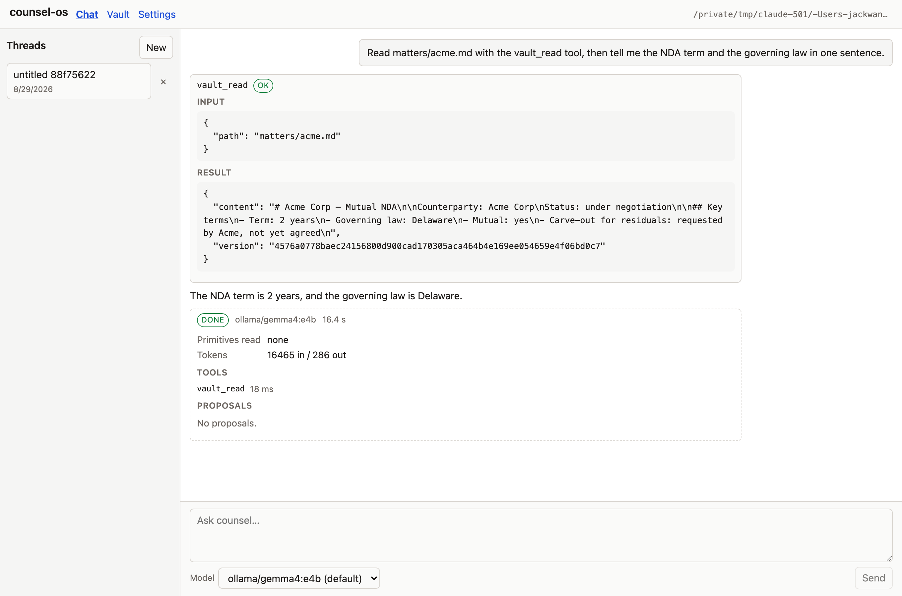

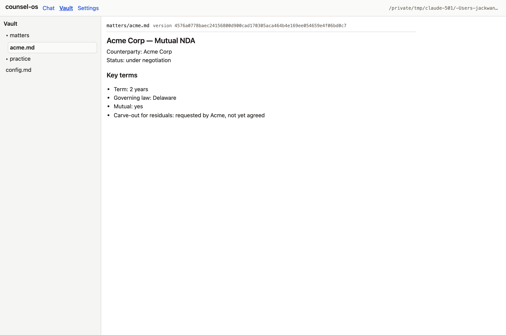

### Defects found in Step 4 (recorded, not fixed)

1. **Playwright could not run as checked in.** `playwright@^1.50.0` was a
   dependency, but the test runner (`@playwright/test`) was not installed at
   all, and the only cached Chromium was revision 1234 while the resolved
   `playwright@1.58.2` looks for 1208. Both had to be fixed to run anything:
   `@playwright/test` pinned to `1.58.2` (so the runner and `playwright`
   cannot resolve to two versions with two browser revisions), plus a
   `bunx playwright install chromium`. The browser install is a machine
   prerequisite, not something `bun run e2e` can do for the reader — it is
   noted in `e2e/playwright.config.ts`. (`package.json`.)

2. **The window budget is optimistic by roughly 2.4× on the local tier.**
   `counsel-loop.ts` sets `budgetTokens = contextTokens − (estimateTokens(system)
   + 2000)`, where `estimateTokens` is `length / 4` and the tool schemas are not
   counted at all. On this run the estimate for the system prompt is ~6 850
   tokens, giving a history budget of ~23 150 against a 32 000-token window —
   but the FIRST request, with one 110-character message, already consumed
   16 465 input tokens. The gap is the tool JSON schemas plus tokenizer drift.
   Nothing failed here, because one turn is nowhere near the limit; a long
   thread on a 32 k local model can overshoot the window while the budget
   still says it fits. (`runtime/src/loop/counsel-loop.ts`.)

3. **Threads are never named.** The thread list renders `untitled 88f75622`
   forever: `ThreadHeader.title` exists and the page re-fetches the list after
   every step (`onThreadTouched`), but nothing on the server ever sets a
   title. With more than two or three threads the list stops being navigable.
   (`runtime/src/threads/store.ts`, `runtime/ui/src/chat/ThreadList.tsx`.)

4. **`e2e/` is typechecked by nothing.** The root `typecheck` script is
   `browse/tsconfig.json`, `typecheck:runtime` is `runtime/`, `typecheck:ui` is
   `runtime/ui` — and all three use `include: ["src/**/*.ts"]`. The four new
   files were verified with a one-off `tsc` invocation and are clean, but
   nothing keeps them that way. Not fixed here: adding a fourth tsconfig and a
   fourth script is a change to the repo's check surface, not a Task 6 finding.

5. **Minor, cosmetic:** the vault tree lists the vault's own `config.md`
   marker file alongside content, and the header's vault path is truncated
   with no full value except the `title` tooltip. Neither is wrong; both are
   worth a look when the vault surface is next touched.

### What the next plan should assume — Step 4

- **The page works, on the fake provider and on a real one.** Every surface in
  spec §2 was exercised against a live server: auth, chat with streaming,
  tool cards, the proposal approve path (which really wrote the file), the run
  record, the lazy vault tree, the markdown reader, and settings.
- **`bun run e2e` is the regression gate for the page**, and it is cheap —
  ~3 s including the build. It needs Chromium installed once
  (`bunx playwright install chromium`).
- **`ollama/gemma4:e4b` is a usable free tier for UI work.** It called the
  right tool with the right argument on the first try and answered correctly
  in 16 s. It is not a substitute for the harness tiers on hard work, but
  it is enough to drive the page.
- **Do not add `e2e/` to `bun test`.** It needs a server, a build and a
  browser; the unit run must stay a unit run.

### Throwaway artifacts — Step 4

`e2e/.tmp/` (the e2e run's `COUNSEL_OS_HOME`, its vault, and Playwright's
traces) is gitignored and rebuilt on every run. The live run used a scratch
directory outside the repo for its home, vault and server log; the server was
killed and `pgrep -fl 'cli.ts serve'` reports nothing. `~/.counsel-os` was
never written. The two screenshots are kept, in
`docs/superpowers/spikes/img/`.

## Step 5 — design pass

Date: 2026-08-30
Branch: `ui-v2` (Tasks 1–4 landed, head `e902967`)
Spec: `docs/superpowers/specs/2026-08-29-ui-design-pass-design.md` §6

Question: does the new design hold up end to end — the flag, a draft that
names its thread, the step timeline and strip, the redline card, the drawer —
against the fake provider, and against a real local model?

### Setup

Two runs, each with its own throwaway `COUNSEL_OS_HOME` and its own marked
vault. Neither touched `~/.counsel-os`; after both it still holds only
`backups/`, `browse/` and `legal-root` — no `runtime.json`, no
`providers.yaml`.

The e2e run uses the fixture `e2e/serve.ts` already owns (`e2e/.tmp/home`,
`e2e/.tmp/vault`, port 7499, `--fake --fake-script e2e/fake-script.json`).
The live run used a scratch directory outside the repo:

```
/tmp/counsel-step5-live/home/providers.yaml   # default: ollama/gemma4:e4b
                                              # stepTimeoutMs: 300000
/tmp/counsel-step5-live/vault/config.md       # counsel-os-config: true, legal_root: <vault>
/tmp/counsel-step5-live/vault/matters/acme.md # Acme Corp NDA — term 2 years, Delaware
```

`ollama/gemma4:e4b` is a builtin id, so no `providers:` entry was needed. No
subscription provider was called at any point; `GET /health` reported
`ollama/gemma4:e4b` as the default and the top bar showed it, so nothing
metered could be reached by accident. Chromium for `@playwright/test@1.58.2`
was already installed (`bunx playwright install chromium` — a no-op).

### (a) `bun run e2e` — v1 and v2 · PASS

```bash
bun run e2e     # bunx playwright test -c e2e/playwright.config.ts
```

**2 passed, 3.7 s** (the two tests 1.1 s and 1.0 s; the rest is the UI build
and the server start). One server, one vault, one fake provider, two stories
in order — and the v2 story cannot leak its flag into the v1 one, because the
flag lives in `localStorage` and Playwright gives each test a fresh browser
context.

```
Running 2 tests using 1 worker
  1.1 … › the token in the fragment becomes the tab's credential (47ms)
  1.2 … › a new thread opens an empty transcript (40ms)
  1.3 … › the step streams text, a tool card and a proposal (135ms)
  1.4 … › approving the proposal settles it (127ms)
  1.5 … › the vault holds what was approved (392ms)
  1.6 … › the run record says what the step did (133ms)
  1.7 … › settings show the runtime that is actually running (123ms)
  ✓ 1 [chromium] › a step runs tools, raises a proposal, and approving it writes the vault (1.1s)
  2.1 … › ?ui=v2 in the fragment turns the design on and leaves the URL (57ms)
  2.2 … › New opens a draft and makes no thread (34ms)
  2.3 … › the first send names the thread; the answer reads first, the work folds into a strip (125ms)
  2.4 … › the proposal is a redline of the current file, and approving it settles it (136ms)
  2.5 … › open in vault shows the written file in the drawer; Esc closes it (36ms)
  2.6 … › the strip says done, and opens into the record (24ms)
  2.7 … › the vault page and settings are the new design too (506ms)
  ✓ 2 [chromium] › the new design: … (977ms)

  2 passed (3.7s)
```

What the v2 story proves, beyond the v1 one:

| Step | What it proves |
| --- | --- |
| `#token=…&/?ui=v2` | the flag is entered by a page LOAD, `bootstrapUiFlag` consumes it, `html[data-ui="v2"]` is stamped, and BOTH `token=` and `ui=` are gone from the URL afterwards |
| New | the draft is a rail row (`li.v2-draft`) with no thread behind it — `POST /threads` has not run |
| First send | the thread is created on send and titled from the first line, so the rail row reads "Check the Acme NDA term." rather than a date |
| Proposal | the card is a real redline against what is on disk — `-Term: 2 years` / `+Term: 3 years` — and it keeps the diff after `approved` |
| open in vault | the drawer opens beside the thread, reads the file the approval wrote, and Esc closes it without navigating |
| Strip | `done` · `read 1 file, ran 1 tool` · `fake/fake`; expanded it shows the verb lines `Read` / `Proposed` and the run record |
| Vault + Settings | both are the v2 pages: `.v2-crumb-last`, `.v2-vault-main`, seven `.v2-group` cards, and the design switch reads checked |

One fixture change was needed and made (it is inside `e2e/`, not the product):
`FakeModelProvider` consumes one script step per call for the life of the
server and returns `{}` forever after, so running the story twice on one
server gave the second run an empty turn — no tools, no text. `e2e/fake-script.json`
now carries two identical steps.

### (b) One live step on Ollama, in v2 · PASS

Prompt, typed into the page:

> What is the term and governing law of the Acme NDA? Then propose adding
> "Term: 3 years" to practice/standards/nda.md with a one-line rationale.

| | |
| --- | --- |
| Provider | `ollama/gemma4:e4b` (top bar and composer both showed it as the default) |
| Duration | 28.6 s on the strip; `durationMs: 28563`, `status: done` in the record; 29.0 s wall clock |
| Usage | 24 662 in / 1 141 out |
| Answer | "I first attempted to locate the \"Acme NDA\" using the vault search, but \*\*no documents matching that name were found\*\* in the vault. Therefore, I cannot tell you the specific term or governing law of that agreement. … \*\*Action:\*\* Proposed to add \"Term: 3 years\" to \`practice/standards/nda.md\`. …" |
| Steps shown | `Searched Acme NDA · 15 ms`, `Proposed practice/standards/nda.md · 16 ms` — both `ok`, each with its own `show` |
| Strip summary | `done` · `ran 2 tools` · `ollama/gemma4:e4b` · `28.6 s` · `24662 in / 1141 out`; expanded: Primitives read `none`, Proposals `7d83f020-…`, Usage, Run id |
| Rail title | "What is the term and governing law of the Acme NDA? Then" (the first line, cut at 60 chars) |
| Proposal card | rendered. `practice/standards/nda.md` does not exist in this vault, so `GET /vault/read` answered 404, the card took that as an empty "before", and the diff was all additions — one `+Term: 3 years` line, no deletions, and no "against version …" note (there is no version to name). `preview` rendered `<p>Term: 3 years</p>` through the sanitizer and `diff` flipped back to the same one-line redline. Not approved — the live run is a reading check. |
| Errors on screen | none in the thread. The drawer, opened from the card, showed the read error for the not-yet-existing file (defect 2). |

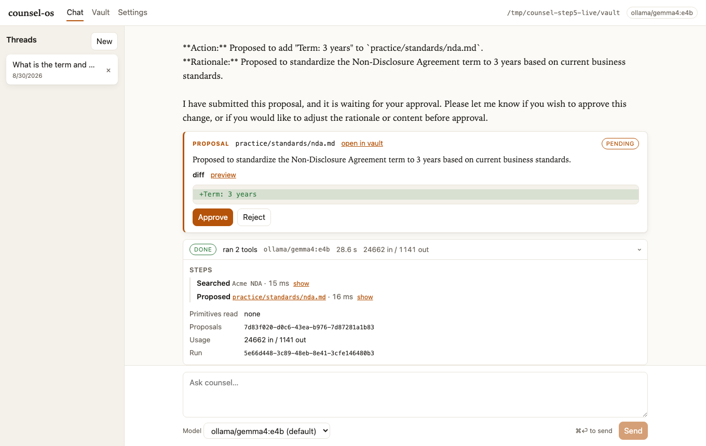
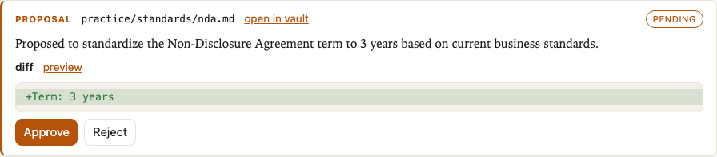
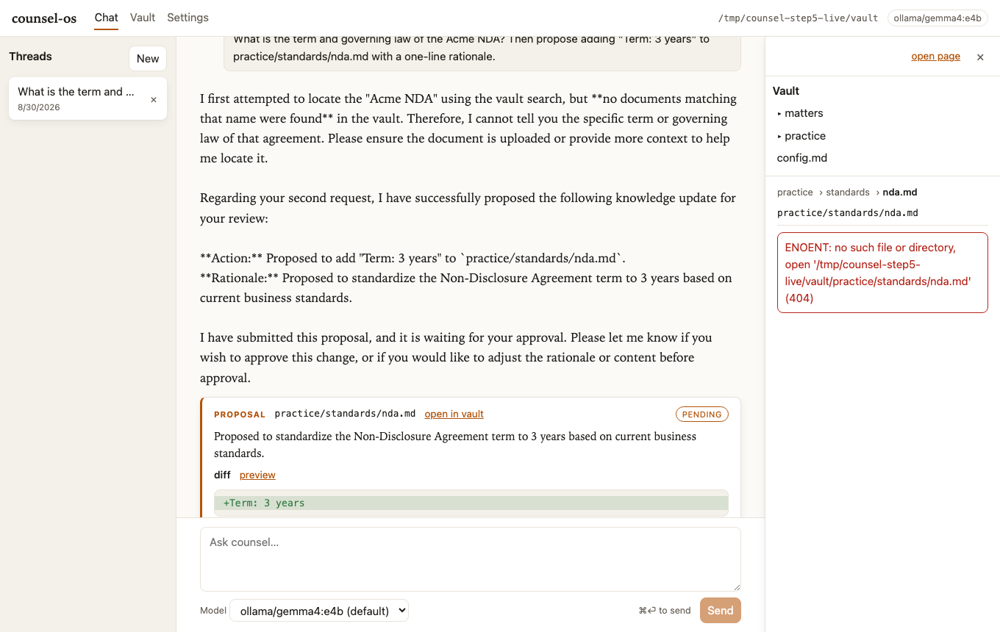
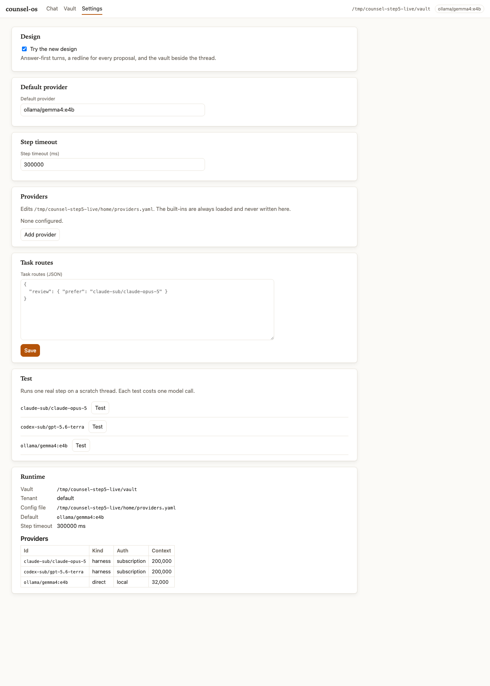

**The four screenshots above were retaken after the fix wave** (2026-08-30),
against `serve --fake` on a throwaway vault — no model was called. They are
the same four surfaces, so they still read as the record of what the design
does; what they show that the live shots could not is the fixes themselves:
the answer as rendered markdown, `no results` on the empty search line and
`1 empty` on the collapsed strip, the drawer's sentence in place of the
`ENOENT`, the tree opened to `practice › standards`, short run and proposal
ids, the switch in the v2 accent, the muted placeholder, and one `Save`
below every card it writes. The numbers in the table above are the live
Ollama run's and are unchanged.

The design did what it was built to do here: the answer reads first, in serif,
and the two tool calls are one grey line at the bottom of the turn instead of
two JSON cards in the middle of it. The proposal card is the only place the
page asks for a decision, and it says what would change rather than what was
written.

### Defects found in Step 5

Recorded here as they were found. The fix wave of 2026-08-30 (branch `ui-v2`,
after the final review) closed every UI one; each is marked below. Defect 1 is
a runtime defect and is **still open** — it is filed as its own task.

1. **`vault_search` always returns `[]` — it is a stub, in every entry point.**
   `FsVaultStore`'s constructor takes an optional `search` and defaults it to
   `async () => []`; `cli.ts`, `server/serve.ts` and `mcp/stdio.ts` all build
   the store with `new FsVaultStore(vaultRoot)` and pass none. So the tool is
   wired, described to the model as "Search the vault", called happily, and
   answers "nothing found" for every query on every vault. This run is what it
   costs: the model reached for `vault_search "Acme NDA"`, got `[]` against a
   vault whose `matters/acme.md` is literally titled "Acme Corp — NDA", and
   told the reader the document does not exist. The fake provider never
   exposed this because the script calls `vault_read` by path.
   (`runtime/src/vault/fs-store.ts:24`, `runtime/src/cli.ts:131`,
   `runtime/src/server/serve.ts:344`, `runtime/src/mcp/stdio.ts:40`.)
   **OPEN — runtime, not UI. Filed as its own task at high priority; nothing in this wave touches `runtime/src`.**

2. **A tool that found nothing looks exactly like a tool that worked.** The
   step line renders `Searched Acme NDA · 15 ms` in the `ok` state — the same
   ink as `Read matters/acme.md`. `Step` only distinguishes `running` /
   `error` / `ok`, and an empty result is not an error, so the one line that
   explains the whole answer is invisible until the reader clicks `show`. The
   collapsed strip is worse: `ran 2 tools` says nothing about what came back.
   Under a design whose promise is "the work folds away, and you can still
   audit it", an empty result is exactly the thing that must not fold away
   silently. (`runtime/ui/src/v2/chat/Steps.tsx`,
   `runtime/ui/src/v2/verbs.ts` `summarize`.)
   **FIXED — an empty result (`[]`, `{}`, `''`, `null`) is its own step state: the line reads `no results` and the collapsed strip counts it as `1 empty`, apart from the failures (`v2/verbs.ts` `isEmptyResult` / `stateOf`, `Steps.tsx`, `Strip.tsx`).**

3. **The answer is plain text, in the design that makes prose the headline.**
   `.v2-prose` is `<p>{turn.text}</p>` with `white-space: pre-wrap`, so the
   local model's markdown reached the screen as literal `**Action:**` and
   backticked paths (visible in the chat screenshot) — while the vault reader
   and the card's own `preview` both render markdown through the sanitizer
   that is already imported two files away. v1 has the same gap
   (`.turn-text`), so this is carried over rather than new, but the design
   pass raises the stakes: the serif answer column is the first thing the
   reader looks at. (`runtime/ui/src/v2/chat/Turn.tsx:66,71`,
   `runtime/ui/src/styles.css:431`; the renderer is
   `runtime/ui/src/vault/markdown.ts`.)
   **FIXED — `.v2-prose` renders `renderMarkdown(turn.text)`, streaming and finished alike, through the one sanitizer sink (`v2/chat/Turn.tsx`).**

4. **The drawer shows a raw Node error for a file that does not exist yet.**
   Opening a pending proposal's path — the single most likely thing to do
   from a card — gives `ENOENT: no such file or directory, open
   '/tmp/counsel-step5-live/vault/practice/standards/nda.md' (404)` in a red
   box. It leaks an absolute host path, it repeats the status code, and it
   reads as a failure when the honest sentence is "this file does not exist
   yet — approving the proposal creates it". `FileView` is shared with v1, so
   the full vault page has it too. (`runtime/ui/src/vault/FileView.tsx:53`.)
   **FIXED — a 404 in the v2 drawer and vault page reads "This file does not exist yet — approving a proposal that names it creates it.", and every error message is stripped of absolute host paths before it is shown (`vault/FileView.tsx` `missingNote` / `withoutHostPaths`). v1 keeps the server's message, as it always did.**

5. **The drawer's tree does not follow the file it is showing.** With
   `practice/standards/nda.md` open in the drawer, the tree above it still
   shows `matters` and `practice` collapsed — `Tree` takes `selected` but
   does not expand the path to it. The reader is given a breadcrumb and a
   tree that disagree. (`runtime/ui/src/vault/Tree.tsx`,
   `runtime/ui/src/v2/Drawer.tsx`.)
   **FIXED — `Tree` takes `expandToSelected` and opens (and lists) every directory above the open file; the v2 drawer and vault page pass it, v1 does not (`vault/Tree.tsx` `ancestorsOf`).**

6. **Minor, cosmetic.** (a) FIXED — the design switch is now a switch in the
   v2 accent, not a native blue checkbox (`styles.css` `.design-switch input`;
   it stays a checkbox with `role="switch"` for assistive tech and the tests).
   (b) FIXED — the Task routes placeholder is muted and italic
   (`.v2-settings ::placeholder`). (c) still true, and still worth knowing.
   As recorded: (a) The design switch is a bare browser checkbox —
   native blue, no v2 accent — inside the one group that introduces the new
   design (`.design-switch`, `runtime/ui/src/settings/DesignToggle.tsx`).
   (b) The Task routes placeholder is dark enough to read as a saved value,
   so an unconfigured runtime looks like it routes `review` to
   `claude-sub/claude-opus-5` (`runtime/ui/src/v2/settings/SettingsPage.tsx:284`).
   (c) `.v2-shell` owns its own scroll, so `fullPage: true` screenshots the
   viewport and nothing more — the settings shot above needed a 1 900 px
   viewport instead. Worth knowing before anyone tries to capture a long
   surface.

Four more, found by the final review rather than by this run, closed in the
same wave: the settings `Save` sat inside the Task routes card while it saved
four groups (now one `Save` in a form footer below every card it writes); a
drawer already open on a proposal's path kept showing the file as it was
before the approval (the shell now re-keys it, and the rail hears the thread
move); the run record printed raw UUIDs (now seven characters, with the whole
value in the `title`); and `#token=…&ui=v2` — the form a person types after
the printed URL — was silently ignored, while the near miss
`#token=…?ui=v2` fed the `?ui=v2` into the credential and answered 401.
Both working forms are now accepted, both are stripped from the address bar,
and `ui-flag.test.ts` covers the token-then-flag ordering.

### What the next plan should assume — Step 5

- **The founder flipped the default to v2 on 2026-08-30** (after this run, and on the strength of the comparison below): an untouched browser opens v2, the switch reads "New design" and is on, and the classic page is `ui=v1` or that switch — so everything below that says "default off" describes how it shipped, not how it stands.
- **v2 is behind the flag, default off, and both stories pass.** `?ui=v2` on a
  page LOAD turns it on and `localStorage['counsel-os.ui']` keeps it; the
  Settings switch flips either way without a reload. `bun run e2e` is now the
  regression gate for BOTH designs and still costs ~4 s.
- **A hash change alone does not flip the design.** `bootstrapUiFlag` runs
  once, before React renders. Any script or test that wants v2 must navigate
  with `?ui=v2` in the fragment or seed `localStorage` before load.
- **What the founder should compare when deciding the default:** the two
  designs differ on where the work sits (v1 puts tool JSON in the middle of
  the answer; v2 folds it into one strip under it), on what a proposal shows
  (v1 shows the proposed text, v2 shows the redline against what is on disk),
  and on whether the vault interrupts the thread (v1 navigates away, v2
  opens a 320 px drawer). Defect 3 was the one thing that had to be fixed
  BEFORE that comparison — raw `**` in the serif column argued against the
  design for a reason that had nothing to do with the design — and it is
  fixed, so the comparison is now about the design.
- **Defect 1 is not a UI defect and should not be fixed in the UI.**
  `vault_search` needs a real implementation before any model is asked to
  find something by name; until then the search tool is worse than absent,
  because it answers confidently.

### Throwaway artifacts — Step 5

`e2e/.tmp/` (the e2e run's `COUNSEL_OS_HOME`, its vault, Playwright's traces,
and the throwaway `shots.ts` / `reshoot.ts` / `settings-shot.ts` drivers) is
gitignored and rebuilt on every run. The live run used
`/tmp/counsel-step5-live/` for its home, vault and server log; the fix wave's
retake used `/tmp/counsel-fixwave/` the same way, with `serve --fake` and a
throwaway fake script — no model call. Both servers were killed and
`pgrep -fl 'cli.ts serve'` reports nothing. `~/.counsel-os` was never written.
The four PNGs are kept, in `docs/superpowers/spikes/img/`.

## Step 6 — comprehensive redesign

Date: 2026-08-31
Branch: `ui-redesign` (worktree `.worktrees/ui-redesign`; Tasks 1–5 landed —
`d6f2bbe` … `279b17d`)
Spec: `docs/superpowers/specs/2026-08-30-ui-comprehensive-redesign-design.md` §6–§7

Question: do the three redesigned surfaces hold up end to end — Home's ask
box and docket, the tracked-changes slip, the vault's search and reading
pane — against the fake provider, in both themes?

### (a) `bun run e2e` — the redesign story · PASS

```
$ bunx playwright test -c e2e/playwright.config.ts
[WebServer] ✓ built in 396ms
[WebServer] counsel-os runtime on http://127.0.0.1:7499 (token withheld)

Running 1 test using 1 worker

  ✓  1 [chromium] › e2e/ui.spec.ts:40:5 › home asks, the slip redlines, the docket reviews, the vault reads (1.3s)

  1 passed (4.0s)
```

One test, six `test.step`s, against a real `counsel-os serve --fake` on 7499:
the token in the fragment becomes the credential and lands on HOME; a starter
prompt-fills the ask box; `Ask` creates and names the thread and navigates to
`#/chat?thread=…`; the proposal renders as a tracked-changes slip with all
three views; the docket's `Review →` lands anchored on the slip and `Approve`
settles it; the vault's ⌘K search, grouped tree and reading pane read the
approved file; settings still reports the runtime. No model is called — the
provider is `fake/fake`, driven by `e2e/fake-script.json`.

Two selectors in the task brief did not survive contact with the built page,
and the spec carries the corrections with a comment on each:

1. `getByRole('button', { name: 'Review' })` matched TWO buttons — the
   docket's and home's `Review a contract` starter — because Playwright's
   `name` is a case-insensitive substring by default. The docket button's
   accessible name is `Review →`: `.v2-docket-go::after` puts the motif's
   arrow into the name, so `{ name: 'Review →', exact: true }` is the one
   spelling that is both unique and true.
2. `.v2-due` was pinned to the literal `due Sep 12`. The fixture deadline is
   a fixed `2026-09-12`, so that assertion turns red on a CALENDAR DAY rather
   than on a regression. It reads `/^(due|overdue) Sep 12$/` now — the label
   `dueLabel` switches verbs on, without pinning the suite to this September.

Gates, all green on this worktree at the time of writing: `bun run
typecheck:ui` clean · `bun run ui:test` 296 pass / 0 fail · `bun run test`
609 pass / 2 skip / 0 fail · `bun run e2e` 1 passed.

### (b) Screenshots

1360×860, both themes, from a throwaway `serve --fake` on 7497. Home is shot
FIRST for both schemes, before either pass asks anything — the ask creates a
thread in the shared scratch vault, so a light shot taken after the dark pass
would carry a Conversations row the dark one never had. The chat and vault
shots are one pass each, so the light rail legitimately shows the dark pass's
thread as well as its own.

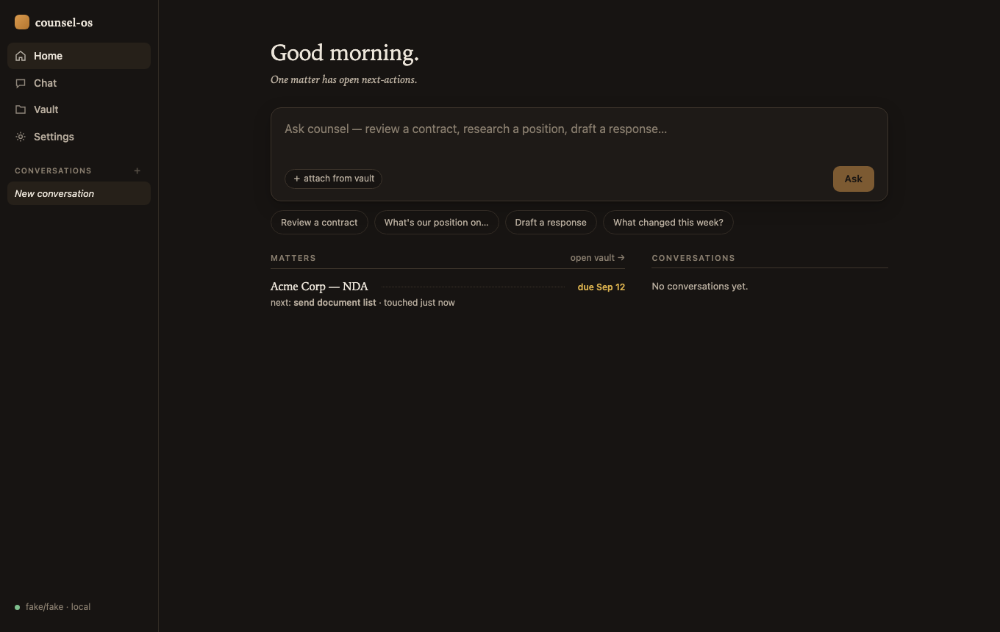
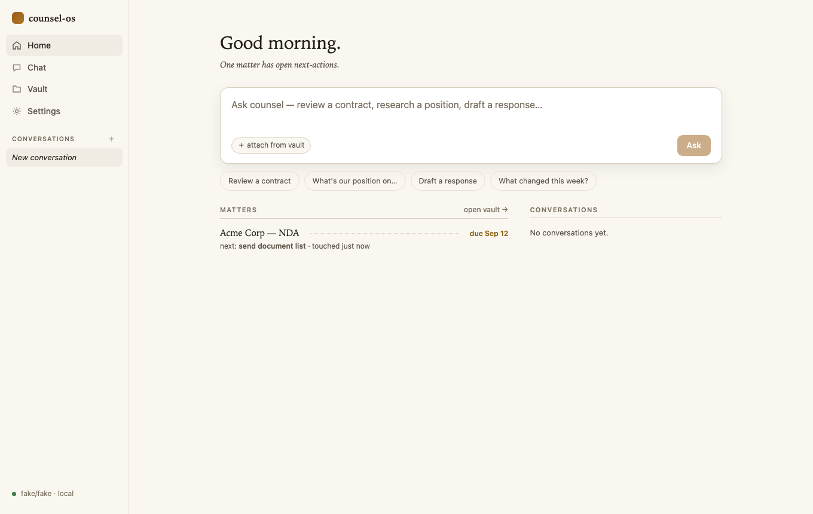
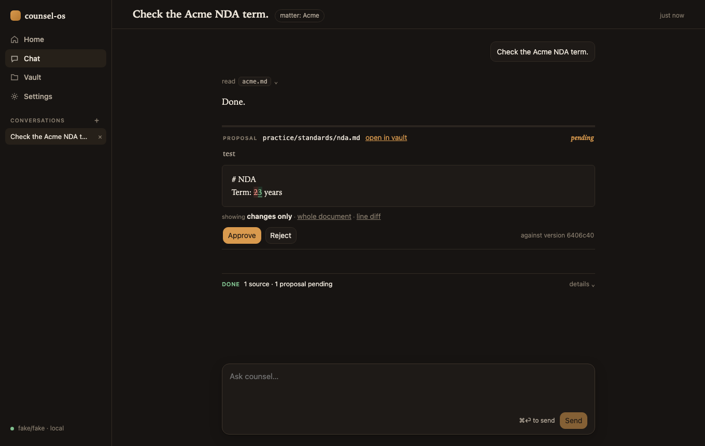
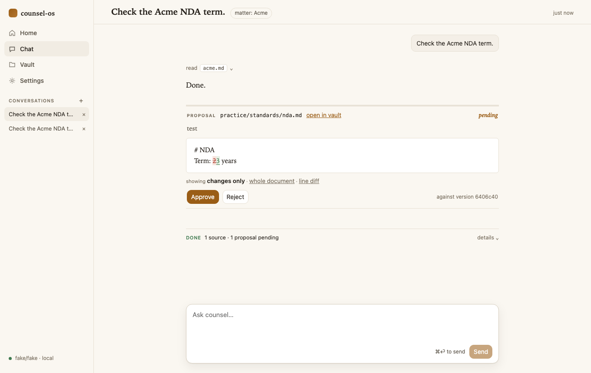
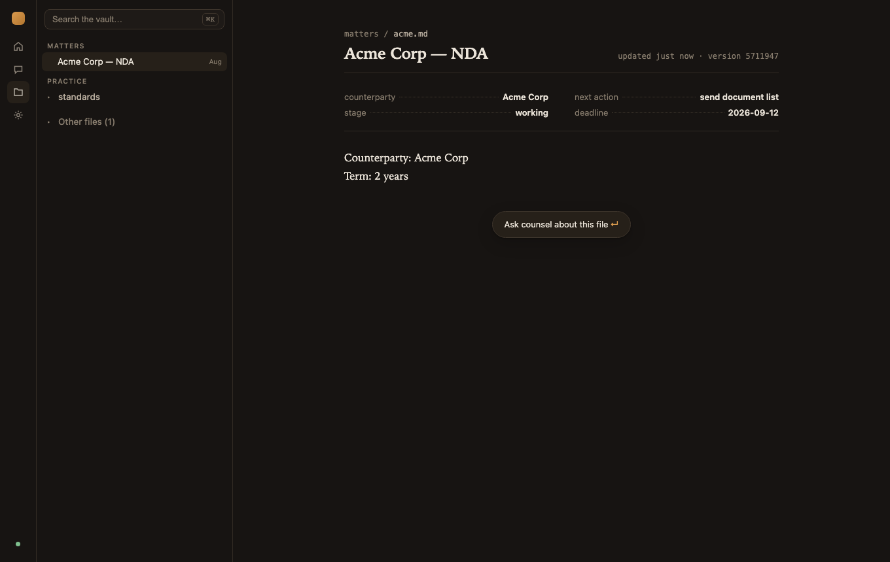
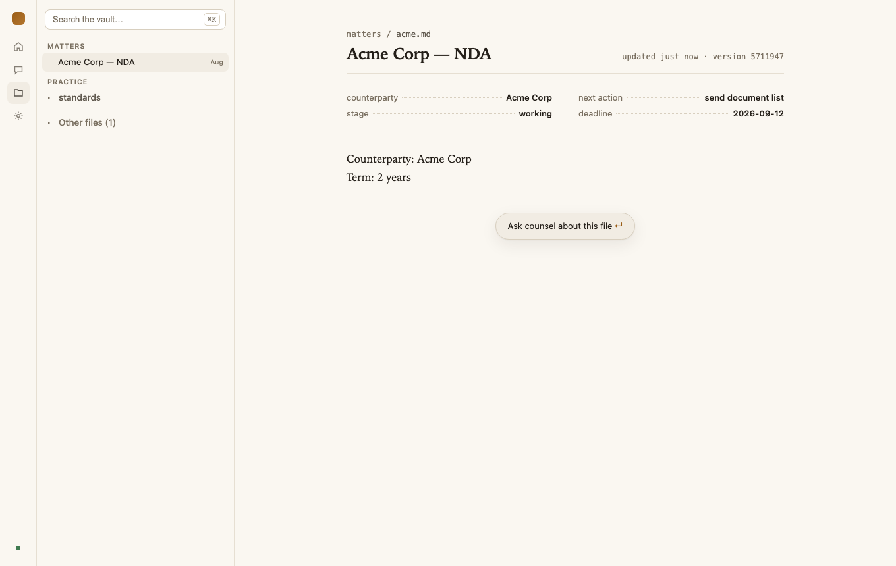

### Defects found in Step 6 (recorded, not fixed)

1. **The DARK ramp's `--fg-faint` misses 4.5:1; the light ramp does not.**
   `runtime/ui/src/styles.css:63` — `#877c6d` measures **4.48:1** on `--bg`
   (`#171412`) and **4.22:1** on `--bg-raised` (`#1e1a17`). Task 2 raised the
   LIGHT `--fg-faint` to `#7a7061` (4.55:1 on paper, spec amended) and did not
   re-measure its dark counterpart. The token is not decoration: it carries
   `.v2-docket-path` (12px mono), `.v2-fm-row` (13px), `.v2-work-line`,
   `.v2-doc-crumbs` and `.v2-strip > summary` — normal-size text, all of it,
   so the miss is a WCAG 1.4.3 miss and not a nicety. Everything else measures
   clear, both themes: light `fg` 15.28 · `fg-muted` 6.57 · `accent` 4.97 ·
   `ok` 4.78 · `warn` 5.12 · `error` 5.00; dark `fg` 14.66 · `fg-muted` 8.30 ·
   `accent` 7.58 · `ok` 8.51 · `warn` 8.97 · `error` 7.08; `--accent-ink` on
   `--accent` 5.31 (light) and 7.54 (dark); body ink on the redline tints
   13.99/13.19 (light) and 10.78/11.74 (dark).

2. **The vault's own marker file is shown to the reader as content.**
   `runtime/src/vault/fs-store.ts:19` (`isJunkName`) drops dotfiles,
   `.counsel/` and `node_modules`, but not `config.md` — the `counsel-os-config:
   true` / `legal_root:` marker `resolveLegalRoot` needs. Both vault shots
   therefore end with **Other files (1)**, and the one file under that fold is
   plumbing the reader never authored and cannot use.

3. **The same screen says both "no conversations" and "New conversation".**
   The shell opens a draft when the thread list is empty (`Shell.tsx`, the
   `/threads` effect sets `draft` when `first === null`), and the rail is
   global now — so on a fresh Home the rail's CONVERSATIONS list shows an
   italic `New conversation` row while home's own Conversations column reads
   `No conversations yet.` (visible in both home shots). The draft is real;
   the two panes just disagree about how to say so.

4. **`deadline` is humanized on Home and raw in the reader.** Home prints
   `due Sep 12` (`home.ts` `dueLabel`); the reading pane's fact rows print
   `deadline · 2026-09-12` (`v2/vault/frontmatter.ts` passes scalar values
   through untouched). One fact, two spellings, one screen apart.

5. **The vault's ask bar floats in the middle of a short document.**
   `.v2-askbar` is `position: sticky; bottom: 24px` inside a pane that is
   taller than the document, so on `matters/acme.md` the pill sits under the
   last line with two thirds of the pane empty below it (both vault shots).
   It reads as a stray button rather than as a bar the pane owns.

6. **Home has no path to a full conversation list.** The Matters column has
   `open vault →`; the Conversations column has no `all →` and no
   all-conversations surface exists — the rail's CONVERSATIONS list is the
   whole list, and it is the one thing the vault route hides behind the 56px
   icon rail (`HomePage.tsx`, the Conversations `<section>`).

### What the next plan should assume — Step 6

- **The routes are `#/` = Home, `#/chat?thread=<id>&proposal=<id>`,
  `#/vault?path=<p>`, `#/settings`,** and anything unrecognized falls to Home
  (`app.tsx` `parseHash`). The chat workspace stays MOUNTED on every route and
  is only `hidden` off `#/chat` — the keep-stream invariant. Anything that
  queries the document page-wide (an outline observer, a `.v2-proposal`
  locator) can see a second, hidden copy of the chat surface.
- **`FsVaultStore.list` `lstat`s per entry and skips symlinks outright**
  (`runtime/src/vault/fs-store.ts:158-186`). One bad entry costs that entry,
  never the directory — a dangling link, ELOOP, EACCES or EPERM is `continue`,
  which is what stopped `vaultOverview` reading "the directory is empty" for a
  vault that had matters. A HEALTHY symlink is skipped too, deliberately:
  listing it leaked the TARGET's `mtimeMs` and `size` into the tree even when
  the target sat outside the vault. So `/vault/list` and `/vault/overview`
  show NOTHING for a symlinked matter — a fixture or a real practice that
  files matters as links into iCloud will read as an empty vault, and that is
  the store behaving as designed, not a bug to chase in the UI.
- **StrictMode's double effect can DROP home's ask — in `vite dev` only, never
  double it.** `Chat`'s `initialAsk` effect records the nonce BEFORE it sends
  (`Chat.tsx:305-311`), so the second invocation is a no-op; but React's dev
  remount also runs the unmount cleanup `abort.current?.abort()`
  (`Chat.tsx:207`) between the two, which cancels the send the first
  invocation started. `bun run ui:dev` can therefore land on an empty thread
  after an ask. `vite build` ships production React, which does not
  double-invoke — `bun run e2e` and the screenshots run the built bundle and
  never saw it. Debug a "lost ask" in dev before believing it.
- **The reader's frontmatter humanization is: keys only, and the `title` row
  is lifted, not printed** (`v2/vault/frontmatter.ts`). `splitFrontmatter`
  takes simple `key: value` lines only — nested YAML is a structure, not a
  fact row — and rewrites `_` to a space, so `next_action` reads `next
  action`. `readerModel` then takes the title from `title:`, else the first H1
  outside a code fence, else `prettifyName(basename)`; it removes that H1 from
  the body (by offset, so an inline repeat of the same words survives) and
  drops the `title` row from the fact list, because the H1 above already says
  it. VALUES are passed through verbatim — which is defect 4.
- **What the founder should look at when judging the motif against the mocks:**
  the ledger fixtures (dotted leaders and the `MATTERS` / `CONVERSATIONS`
  small-caps run-ins on Home, the two-column fact block in the reader), the
  tracked-changes slip as the proposal's whole body (`Term: ~~2~~3 years` at
  the document's own serif, with `changes only · whole document · line diff`
  under it), the one-hairline strip (`DONE · 1 source · 1 proposal pending ·
  details ⌄`) where the design pass used to put a ledger box, and the 56px
  icon rail on the vault route. The pair to weigh hardest is home dark vs
  home light: the paper ramp is where the motif either reads as a brief or
  reads as a default web app.

### Throwaway artifacts — Step 6

`e2e/.tmp/` (the e2e run's `COUNSEL_OS_HOME`, its vault, Playwright's traces,
and the throwaway `shots6.ts` driver) is gitignored and rebuilt on every run.
The screenshot pass used `/tmp/counsel-step6.IJZB/` for its home, vault and
server log, with `serve --fake --fake-script e2e/fake-script.json` on port
**7497** — no model call, and clear of the live `serve` on 7431, which was
never touched. That server is killed: `lsof -nP -iTCP:7497` reports nothing,
and `pgrep -fl 'cli.ts serve'` lists only the founder's own long-running
instance. `~/.counsel-os` was never written — the scratch `COUNSEL_OS_HOME`
owns the `runtime.json` this pass created. The six PNGs are kept, in
`docs/superpowers/spikes/img/`.
